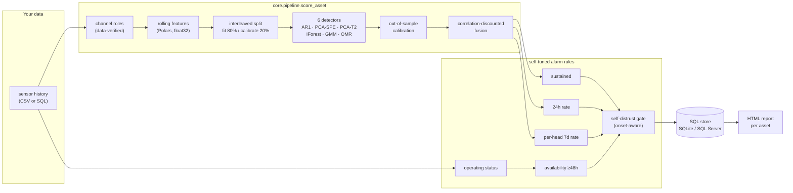
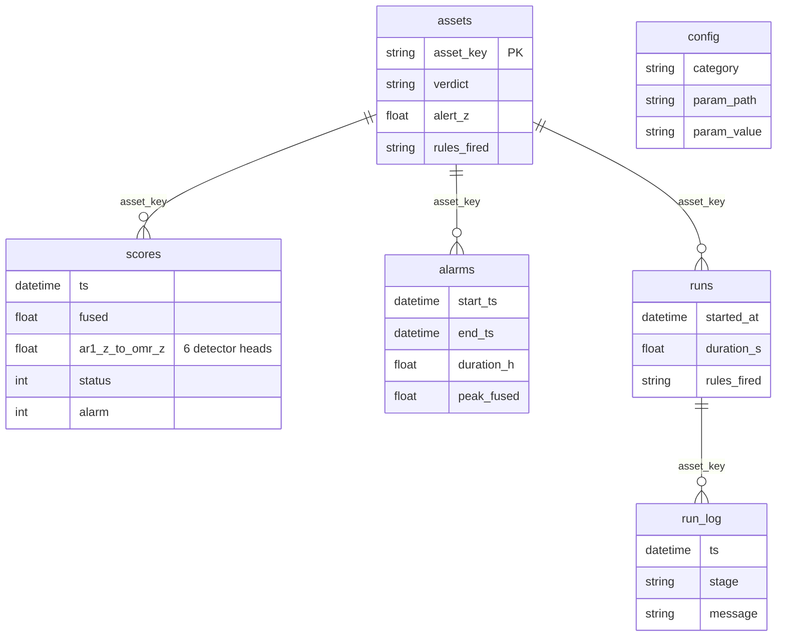

# ACM — Autonomous Condition Monitoring

ACM watches industrial assets and tells you when something is wrong — **with
no labels, no training-data preparation, and no human tuning**. Point it at
any asset's sensor history (CSV or SQL): it learns what normal looks like
from t=0 (faults in the history included), sets its own alarm thresholds,
distrusts its own miscalibrated detectors, and retains everything in SQL —
human verdicts and the full data-science substrate.

## One command on any Windows machine — no Docker, ever

```powershell
irm https://raw.githubusercontent.com/bhadkamkar9snehil/ACM/main/setup_acm.ps1 | iex
```

Installs Git/Python if missing (winget, or official installers when winget is
absent), clones ACM, installs dependencies, runs a quiet self-test. SQL Server
is optional — SQLite is the default store and needs nothing installed.

Then score your own data:

```powershell
python scripts\acm_run.py --csv pump7.csv --timestamp-col time --score-days 30 --report report.html

# a whole fleet, in parallel
python scripts\acm_run.py --csv data\*.csv --score-days 30 --workers 3 --db acm_results.db --report fleet.html
```

## How it works



**Detectors** answer six independent questions about every sample:

| Head | Question |
|---|---|
| AR1 | Is a sensor moving against its own dynamics? (p95 over per-sensor z) |
| PCA-SPE | Have sensors decoupled from the learned correlation structure? |
| PCA-T2 | Is the operating point abnormal? |
| IForest | Is this a rare state? |
| GMM | Does this match any known operating mode? |
| OMR | Which sensors stopped following the others, and how badly? (top-3 per-feature residual) |

**Self-tuned rules** derive every operating point from the asset's own
unlabelled history: the *sustained* rule outlasts the worst healthy excursion,
the *rate* rules exceed the worst healthy day/week with additive headroom, the
*availability* rule flags unplanned outages beyond 48 h, and the *distrust
gate* discards any behaviour rule that claims the majority of a window without
an onset — a drifted baseline, not a detection.

## Validation

**Public benchmark** — CARE-to-Compare ([zenodo.org/records/15846963](https://zenodo.org/records/15846963)),
labelled wind-farm faults, zero labels shown to the model, one universal
ruleset, cold-start from t=0:

| Farm | Faults detected | Normals clean | F1 |
|---|---|---|---|
| A (onshore, 86 ch) | 12/12 | 8/10 | 0.92 |
| B (offshore, 257 ch) | 3/6 | 7/9 | 0.55 |
| **Pooled (33 events)** | **15/18** | **15/19** | **0.81 — KPI PASS** |

Reproduce: `.\scripts\run_care_benchmark.ps1` (KPI: recall ≥ 0.80, F1 ≥ 0.75).
Additional machines: `scripts/download_validation_datasets.py` ships SKAB
(pump rig; first run: 8/34 windows, 1.1% FP — open ML target) and MetroPT-3
(air compressor) adapters.

**ML test suite** — synthetic plants with *injected* faults that must be
caught and clean continuations that must stay quiet
(`tests/test_ml.py`): bearing-style drift, correlation breaks, intermittent
load-dependent spiking, explained seasonal shifts, degenerate channels,
quantized channels, lying channel names. `pytest tests/ -q` runs everything
in under a minute with no SQL and no network.

## Results live in SQL — look inside ACM



Plus two views: **`v_asset_now`** (live monitor — one row per asset: latest
fused score, alarm state) and **`v_daily_stats`** (data science — daily rates,
availability, aggregates). Identical schema on SQLite (default file) and SQL
Server (`--backend mssql`). Sync the human config next to results:
`python scripts\acm_store.py sync-config --db acm_results.db`.

The HTML report (`scripts/acm_report.py`) renders any selection of assets —
fleet, one farm, or `--assets PUMP7` — with the fused timeline, alarm shading,
a per-detector heat strip, and the operations log of what ACM decided and why.

## Design principles

- **ML behaviour is code, not configuration.** `core/ml_defaults.py` holds the
  validated parameters; `configs/config_table.csv` carries only human-operable
  settings (data sources, SQL, runtime, reporting).
- **No cowardly fallbacks.** Unscoreable channels are excluded loudly, never
  silently zeroed or epsilon-scaled.
- **Self-correction over operator intervention.** Out-of-sample interleaved
  calibration, per-asset thresholds, onset-aware self-distrust.
- **Channel roles verified from data, not names.** Pre-derived `_min/_max/_std`
  exports are detected by checking the maths on samples; raw feeds untouched.
- **Lean by force.** One pipeline, one runner, one benchmark, one store, one
  report. Polars only. No Grafana, no Docker.

## Repository map

```
core/                 the ML: pipeline.py (entry), alarm_rules.py, detectors,
                      fast_features.py, fuse.py, ml_defaults.py
scripts/
  acm_run.py          score your assets (CSV or SQL, parallel) -> SQL store
  acm_store.py        canonical store: SQLite / SQL Server, views, config sync
  acm_report.py       self-contained HTML reports, any asset selection
  care_benchmark.py   labelled-fault validation harness (CARE dataset)
  download_care_dataset.py + run_care_benchmark.ps1/.sh
configs/config_table.csv   human settings only
tests/                test_ml.py (injected-fault ML suite), test_store.py
setup_acm.ps1         one-command Windows setup
```
