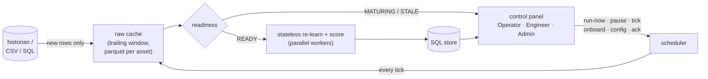

# ACM — Asset Condition Monitor

ACM watches industrial assets and tells you when something is wrong — **with no labels, no training-data preparation, and no human tuning**. Point it at any asset's raw sensor history (CSV or SQL): it learns what normal looks like from t=0 (faults in the history included), sets its own alarm thresholds at the cadence of your data, names the sensors driving every alarm, and retains everything in SQL — human verdicts and the full data-science substrate.

---

## 🚀 Quick Start Guide

### 1. One-Command Setup (Windows)
Open PowerShell and run:
```powershell
irm https://raw.githubusercontent.com/bhadkamkar9snehil/ACM/main/setup_acm.ps1 | iex
```
This installs Git and Python (3.11+) if missing, clones the ACM repository to `$HOME\ACM`, installs all dependencies, and runs an automated self-test.

---

## 🖥️ Running the Always-On Service (Web UI)

ACM runs as an always-on scheduler and control panel. To start the service:

### 1. Start the Service
```powershell
# In the ACM directory, run the service with the default SQLite database
python scripts\acm_service.py

# Or run it with an MS SQL Server backend
python scripts\acm_service.py --backend mssql --conn "DRIVER={ODBC Driver 18 for SQL Server};SERVER=host;DATABASE=ACM"
```

### 2. Access the Control Panel
Open your browser and navigate to:
**[http://localhost:8765](http://localhost:8765)**

The control panel features three screens:
*   **Operator Panel**: Real-time fleet health dashboard with asset state badges, trend sparklines, and one-click alarm acknowledgments.
*   **Reliability Engineer Panel**: Deep-dive diagnostics including fused score timelines, alarm-shading, six-detector heatmap strips, culprit sensors, and daily stats.
*   **Admin / ML Ops Panel**: Service health metrics, task schedules, run logs, and live configuration edits with audit trails.

---

## 📊 Running the CARE Wind Farm Benchmark

To validate ACM's unsupervised ML core against real-world anomalies, you can run the benchmark on the public CARE-to-Compare Wind Farm dataset.

### 1. Run the Benchmark (CLI)
Specify the path to your downloaded CARE dataset:
```powershell
# Run the full Wind Farm A benchmark (22 events, ~20 mins)
python scripts/care_benchmark.py --data-dir "C:\path\to\care_data\CARE_To_Compare\Wind Farm A" --out results/A

# Or run a quick targeted test on 3 specific events (~1 min)
python scripts/care_benchmark.py --data-dir "C:\path\to\care_data\CARE_To_Compare\Wind Farm A" --out results/A --datasets 40 10 68
```

### 2. Ingest Benchmark Results into the Web UI
To visualize the benchmark runs directly in the Web UI:
```powershell
# Load the results directory into the SQLite store
python scripts/acm_store.py ingest --results-dir results/A --farm A --db acm_results.db
```
Once ingested, restart or refresh the service (`python scripts/acm_service.py`) and visit **[http://localhost:8765](http://localhost:8765)** to inspect the scored timelines, active alerts, and detected anomalies.

---

## ⚡ One-Shot CLI Scoring & Visualization

If you want to score raw data and generate reports without launching the service:

```powershell
# Score one asset (CSV): history before the cutoff is baseline, trailing 30 days is scored
python scripts\acm_run.py --csv pump7.csv --timestamp-col time --score-days 30 --report pump7.html

# Score a fleet of CSVs in parallel into one SQLite store
python scripts\acm_run.py --csv data\*.csv --score-days 30 --workers 3 --db acm_results.db --report fleet.html

# Generate a standalone interactive HTML report for specific assets
python scripts\acm_report.py --db acm_results.db --assets PUMP7 --out pump7.html

# List all scored assets in a database
python scripts\acm_report.py --db acm_results.db --list
```

---

## 🛠️ Architecture & Core Pipeline



### Unsupervised ML Pipeline
ACM scores assets statelessly on every tick using six independent detector heads:


---

## 📁 Repository Map & File Descriptions

- 📁 **`core/`**: The ML engine root directory holding pipeline orchestrators and individual detectors.
  - 📄 **`pipeline.py`**: Main entry point for scoring an asset. Handles features, operation splits, calibration, and fusion.
  - 📄 **`alarm_rules.py`**: Implements cadence-aware rules that govern sustained alarms, daily rates, and availability outages.
  - 📁 **`detectors/`**: Contains the 5 distinct detector models: Auto-regressive (AR1), PCA, Isolation Forest, GMM, and OMR.
  - 📄 **`fast_features.py`**: High-speed rolling feature engineering using Polars (trends, deviations, and dynamic values).
  - 📄 **`fuse.py`**: Fuses Z-scores from the detectors, dynamically discounting overlapping or correlated signals.
  - 📄 **`ml_defaults.py`**: Stores default hyper-parameters, thresholds, and calibration bounds for the ML pipeline.

- 📁 **`scripts/`**: Command-line scripts for service operation, one-shot execution, and validation.
  - 📄 **`acm_service.py`**: Runs the FastAPI scheduler service and serves the web control panel interface.
  - 📄 **`acm_feed.py`**: Handles data caching and the readiness/maturity gate to protect the historian from bulk queries.
  - 📄 **`acm_run.py`**: Runs batch parallel scoring CLI over raw CSV or SQL datasets into the SQL store.
  - 📄 **`acm_store.py`**: Manages SQL schemas, syncs config parameters, and ingests offline benchmark runs.
  - 📄 **`acm_report.py`**: Generates self-contained, interactive HTML diagnostic reports for any selected assets.
  - 📄 **`robustness_matrix.py`**: Validates sensitivity and false-alarm rates across a synthetic matrix of asset and fault types.
  - 📄 **`care_benchmark.py`**: Evaluates performance metrics against the public CARE-to-Compare wind farm dataset.
  - 📄 **`download_care_dataset.py`**: Utility script to download and extract the CARE wind farm datasets from Zenodo.

- 📁 **`static/`**: Front-end asset directory containing the web dashboard layout and script assets.
  - 📄 **`index.html`**: Entry point page structure for the Operator, Reliability Engineer, and Admin panels.
  - 📄 **`style.css`**: Styling rules defining the layout, color palettes, and interactive responsiveness.
  - 📄 **`app.js`**: Client-side logic for data polling, chart rendering, and sending API commands.

- 📁 **`configs/`**: Configuration files. Contains `config_table.csv` which houses all parameters editable from the UI.

- 📁 **`tests/`**: Unit and integration testing directory containing pytest suites for service and ML modules.

- 📄 **`setup_acm.ps1`**: Setup script that installs dependencies and prepares ACM for execution.

---

## 💾 Results SQL Schema Reference

| Table / View | Purpose |
| :--- | :--- |
| `assets` | Summary for each asset including verdict, self-tuned thresholds, rules fired, and alert stats. |
| `scores` | Full sensor timeline holding fused indicator, all six detector Z-scores, status, and alarms. |
| `alarms` | Log of contiguous alarm episodes with duration, peak, and acknowledgment comments. |
| `runs` / `run_log` | Detailed runtime log of scheduler actions, processing speeds, and pipeline outputs. |
| `config` / `config_audit` | Current live service configurations and the historical log of config edits. |
| `monitored_assets` | Service asset registry stating the source file/query, current state, and last runtime. |
| `v_asset_now` | SQL view aggregating the current state and unacknowledged alarms for the Operator dashboard. |
| `v_daily_stats` | SQL view calculating daily aggregates, availability rates, and trends for reporting. |
