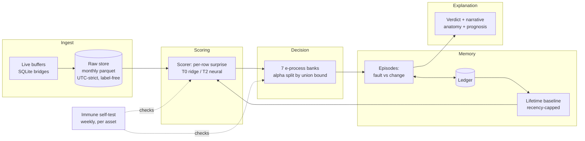
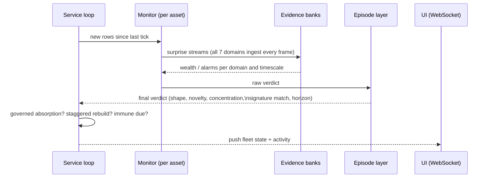
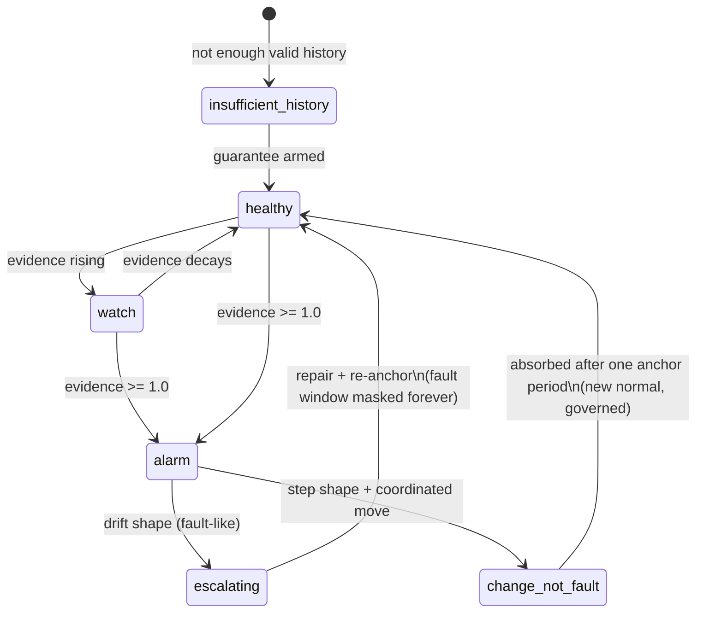
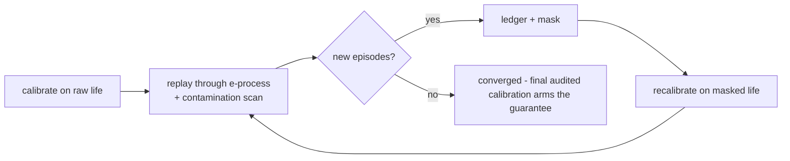

# ACM - Asset Condition Monitor

ACM watches industrial assets and tells you when something is wrong -
**unattended, with no labels, no training-data preparation, no
thresholds to tune, and a mathematically guaranteed false-alarm
budget**. Point it at an asset's raw sensor history and forget it: it
cleans its own first contact with the data, learns what normal looks
like from the asset's entire life, accumulates statistical evidence
before it speaks, explains every verdict, absorbs legitimate operating
changes on its own, checks its own health weekly, and estimates
time-to-failure while a fault develops.

**One dial.** The only configuration in the entire system is
`ALPHA_PER_ASSET_YEAR` (default 1.0): the promised number of false
alarms per asset per year. Everything else is derived from the asset's
own data or is a structural constant with its rationale written next
to it in `src/constants.py`. There is no config file, no per-site
table, no threshold sheet.

```bash
./install.sh          # or: .\install.ps1 on Windows (installs uv, syncs, self-tests)
uv run python -m service --root acm_data --port 8899 --tick-seconds 300
# self-ticking fleet service + zero-build UI: open http://127.0.0.1:8899
```

That starts an empty fleet - nothing to watch yet. To see ACM working
against real sensor history in three more commands:

```bash
uv run python lab/scripts/download_care_benchmark.py --dest care_data --farms A
uv run python -m evidence.seed_demo --farm-dir "care_data/Wind Farm A" --root acm_data
uv run python -m service --root acm_data --port 8899
# open http://127.0.0.1:8899 - every downloaded event is now a fleet asset
```

`download_care_benchmark.py` pulls real wind-turbine SCADA history from
the public CARE-to-Compare dataset (tens of MB per event); `seed_demo`
appends each event as one continuous asset into `acm_data`, and the
service auto-discovers, onboards, and bootstraps everything on startup.

Deep documentation:

| Document | Contents |
|---|---|
| [`docs/how-acm-works.md`](docs/how-acm-works.md) | the complete explanation, from first principles - every layer, every architectural decision and its tradeoff |
| [`docs/src-file-guide.md`](docs/src-file-guide.md) | what every file in `src/` does |
| [`docs/testing-and-datasets.md`](docs/testing-and-datasets.md) | how to test ACM, and how to adapt any dataset into the shape it wants |

---

## Why it is different

Classical monitoring alerts when a score crosses a line - so its
false-alarm rate is whatever the data decides, and "tuning the
threshold" quietly destroys any statistical meaning the score had. ACM
inverts the contract: the operator declares the acceptable false-alarm
rate, and the mathematics guarantees it.

- **No labels, ever.** Fault examples do not exist for the faults that
  matter. Everything is learned from the asset's own unlabeled history.
- **Anytime-valid.** The guarantee holds while checking every tick,
  forever - no multiple-testing penalty, no "you looked too often".
- **Evidence, not scores.** An alarm is the end of an accumulation you
  can watch happening (the UI shows evidence climbing toward the alarm
  line at 1.0), not a point spike crossing a magic number.
- **Honest states.** `insufficient-history` (cannot promise the
  guarantee yet - and says why) and `change-not-fault` (the machine
  changed, legitimately) are first-class verdicts, not errors. When
  the guarantee can only be qualified, the qualification is disclosed.
- **Every verdict is falsifiable.** Each one states what observation
  would overturn it - and that clause is mechanism, not prose: the
  system acts on it.

## The architecture



Every asset is an independent world - its own scorer, banks, episodes,
baseline. A fleet is N monitors; one asset is a fleet of one.

### One tick, end to end



### The verdict lifecycle



## The false-alarm guarantee, in one paragraph

Surprise scores are converted to conformal p-values against a healthy
calibration sample (pure counting - no distributional assumptions). A
betting martingale compounds them into evidence: a fair game under
health, exponential growth under sustained abnormality. Ville's
inequality bounds the probability that the wealth EVER crosses
`1/alpha` - so "evidence >= 1.0 => alarm" carries the promised bound
at every moment of an unbounded watch. Autocorrelation is handled by
aggregating scores into blocks sized from the asset's own measured
decorrelation length - and when the history cannot support a valid
block, ACM **refuses to arm** (honest `insufficient-history`) or arms
with a **disclosed qualification**, never a silent fiction. Alarms
latch until an episode is adjudicated: a self-resetting alarm would
spend the budget twice.

## The seven evidence domains

The alpha budget is split across parallel evidence domains (union
bound - shares sum to exactly 1.0, so the total promise holds no
matter which domain fires). Each is a different failure geometry:

| Domain | Share | Catches |
|---|---|---|
| **magnitude** | 0.40 | diffuse deviation: many channels off at once (mean of per-channel residuals) |
| **channel-local** | 0.10 | single-channel faults that the mean dilutes on wide assets (top-3 residuals) |
| **availability** | 0.15 | the parked/silent machine - absence of data is evidence too |
| **horizon-gap** | 0.10 | slow drift a tracking model would hide (long- minus short-horizon surprise) |
| **predictability-band** | 0.05 | the asset becoming easier OR harder to predict than its history says |
| **transient-response** | 0.10 | startup/shutdown fingerprints drifting from the learned catalogue |
| **dynamics-drift** | 0.10 | the machine's governing dynamics changing shape (operator re-identification) |

## Episodes: fault or change?

Evidence crossing the bound opens an episode, back-dated to the
measured surprise onset. Adjudication uses two independent axes -
*shape* (drifting = fault-like; stepped = change-like) and
*concentration* (channel-local = fault-like; coordinated across
channels = change-like) - because either alone is ambiguous. A
`change-not-fault` episode absorbs automatically once its plateau
holds for one anchor period: the new operating point becomes normal,
governed, with the alpha accounting intact. If the call was wrong,
surprise resumes against the new baseline and a fresh episode opens -
falsifiability as mechanism. Fault episodes never self-absorb.

Every closed episode - fault and absorbed change - lives permanently
in the ledger, giving each asset a case history: new episodes are
matched against it by signature (same channels, same shape: "seen
before, resolved as X") and by trajectory ("tracking the 2025 bearing
failure; ~3 weeks to its peak").

## Lifetime memory

The definition of normal comes from the asset's **entire life**, never
a trailing window: recent data is arithmetically capped at 20% of the
baseline's weight (a slow drift cannot boil the frog - the drift a
trailing window absorbs is exactly the drift ACM alarms on), ledgered
fault windows are masked out forever, and lifetime statistics stay
cheap through mergeable monthly summaries. Calibration samples are
built from consecutive chunks spread across the older life - never
row-striding, which whitens the sample and quietly breaks the
guarantee's block derivation.

First contact runs **detect -> mask -> re-detect to convergence**:



## The immune system

Weekly per asset (staggered), ACM tests itself with no labels: fault
injections at a magnitude ladder into the asset's own held-out data
(the measured detection floor - "will see a 1-sigma drift, not a
0.5-sigma one"), a clean-holdout conformance check (the promise,
spot-checked), a dead-scorer check (a silent zero reads as a healthy
fleet - the worst failure), and counterfactual rehearsal: faults
propagated through the machine's own learned couplings, mapping the
honest detection boundary rather than the flattering one. A sick
result drops confidence and triggers a governed rebuild.

## Hardware tiers - same guarantee, more power

Verdict semantics are identical at every tier; only detection power
differs. The tier is probed, never assumed - and if the probe claims
GPU but torch cannot import, the degradation is loudly visible.

| Tier | Scorer | When |
|---|---|---|
| **T0** | conditional ridge reconstruction | any CPU box |
| **T2 / T2-S** | per-channel neural quantile world model | GPU-class hardware |

First cross-tier datapoint on real SCADA (CARE Farm A, generator
bearing failure): the world model detected at **48h lag vs Tier 0's
240h** on the same event.

## The UI

One HTML file, zero build, all libraries vendored - works air-gapped,
deploys by copying a directory. Real-time over WebSocket with polling
fallback. Chart-first by design:

- **Fleet**: state donut, worst-first evidence bars, confidence-vs-
  evidence scatter (click a dot to open the asset), the alpha-budget
  donut (the guarantee, visible), tick-cost chart, a fleet-wide case
  timeline (every episode, closed and open, as swimlanes over real
  time), sortable detail table with sparklines, a live ticker of the
  latest fleet event on every page.
- **Per asset**: a large raw-telemetry time series (the attribution
  channels over real timestamps, episode windows shaded in place,
  zoomable, raw values in the tooltip); evidence-over-time - every
  domain's accumulation toward the alarm line on a log scale; evidence
  and confidence as bars against the alarm line; health-index
  trajectory with zoom; evidence-domain bars; a domain-by-timescale
  wealth heatmap (every bank's internals, every tick);
  surprise-by-channel bars (attribution you can see);
  familiarity/concentration/novelty gauges with episode-state pills;
  a per-asset live activity feed; anatomy organ bars; failure-time
  distribution; episode timeline; immune floors, detection-profile
  heatmap, and pass/fail pills. The narrative keeps its one-sentence
  judgment visible and folds the full reasoning behind a toggle.

## Commands

```bash
# --- run ---
uv run python -m service --root acm_data --port 8899 --tick-seconds 300
uv run python -m service --root acm_data \
    --live "plant/asset-01=bridge_buffer.db"      # live SQLite bridge (repeatable)

# --- test ---
uv run pytest tests -q                            # full suite
uv run pytest tests -q -m "not statistical"       # fast lane

# --- demo data: seed real CARE events into a live fleet (see the UI work) ---
uv run python lab/scripts/download_care_benchmark.py --dest care_data --farms A
uv run python -m evidence.seed_demo \
    --farm-dir "care_data/Wind Farm A" --root acm_data

# --- evidence lane: real labeled datasets through the production path ---
uv run python -m evidence.care_replay \
    --farm-dir "care_data/Wind Farm A" --out results/care_A \
    --scorer tier0                                # worldmodel | masked | auto
uv run python -m evidence.soak --out results/soak # implement-and-forget gate
```

Feeding data (programmatic seeding, live buffers, adapting any
dataset): [`docs/testing-and-datasets.md`](docs/testing-and-datasets.md).

## API

| Endpoint | Purpose |
|---|---|
| `GET /api/assets` | fleet summary, worst-first, immune counts, the alpha-budget ledger |
| `GET /api/asset/{key}` | the full frozen verdict |
| `GET /api/narrative/{key}` | the verdict as an operator-readable story |
| `GET /api/domains/{key}` | per-domain evidence incl. per-block-size member wealth and exchangeability status |
| `GET /api/health/{key}` | health-index series |
| `GET /api/telemetry/{key}?channels=&rows=` | recent raw-telemetry window, downsampled; defaults to the verdict's attribution channels |
| `GET /api/evidence-history/{key}` | per-domain evidence at every scoring event (the decision layer's own trajectory) |
| `GET /api/episodes/{key}` | case history: ledgered faults AND absorbed changes, plus the open episode |
| `GET /api/cases` | every episode across the fleet - closed and open - for the case timeline |
| `GET /api/immune/{key}` / `POST /api/immune-pass/{key}` | immune status / run a pass now |
| `GET /api/cost` | last-tick wall-clock cost per asset, worst-first |
| `GET /api/stage-cost` | onboard/bootstrap/tick wall-clock cost per (asset, stage), worst-first |
| `POST /api/tick` / `POST /api/tick/{key}` | tick the fleet / one asset |
| `POST /api/reanchor/{key}` | governed episode close + recalibration |
| `POST /api/bootstrap/{key}` | first-contact cleaning on demand |
| `GET /api/report` | fleet report (markdown), worst-first |
| `WS /api/ws` | real-time fleet + activity stream |

## Repository layout

```
src/             the product (flat layout: service.py, runtime.py,
                 monitor.py, episodes.py, decision/, scoring/, memory/,
                 immune/, evidence/, store/, ingest/, ui.html)
tests/           unit + statistical + evidence-machinery tests
docs/            how-acm-works, src-file-guide, testing-and-datasets
install.sh|ps1   one-command install (uv-based)
lab/             the previous-generation system: kept as reference and
                 dataset/benchmark tooling (lab/README.md)
```

## Current evidence (small samples, honestly labeled as such)

- **Operational soak: passed all 8 criteria** over 37.5 compressed
  asset-days: healthy stayed healthy, a coordinated setpoint change
  was declared change-not-fault and auto-absorbed at exactly one
  anchor period, a subsequent fault alarmed on the absorbed baseline,
  zero tick failures, flat memory.
- **CARE Farm A pilot (8 events)**: 0/5 normal events false-alarmed
  (the alpha promise held on real SCADA); the generator-bearing
  anomaly was detected (Tier 0 lag 240h, world model 48h); one
  anomaly alarmed but was classified change-not-fault (recorded as an
  open observation); one was missed on an 8-day evidence runway -
  CARE prediction windows are 8-20 days, a short runway for evidence
  accumulation by construction.
