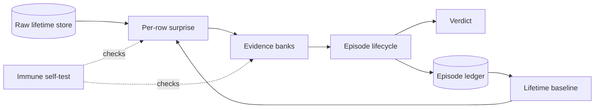

# ACM - Asset Condition Monitor

ACM monitors industrial assets from unlabeled sensor history. It learns each
asset's normal behavior, accumulates anytime-valid statistical evidence, and
raises falsifiable verdicts under a declared false-alarm budget.

The product has one operator dial:

```text
ALPHA_PER_ASSET_YEAR = 1.0
```

Everything else is derived from the asset's data or is a structural constant
with its rationale recorded in `src/constants.py`.

## Install and run

```bash
./install.sh                         # Linux/macOS
# or: .\install.ps1                 # Windows

uv run python -m service --root acm_data --port 8899 --tick-seconds 300
```

Open `http://127.0.0.1:8899`.

The default install is self-contained and air-gap friendly: the UI is a single
HTML file with vendored browser libraries and no frontend build step.

## Put data into ACM

An asset is simply:

- one timezone-aware UTC timestamp column;
- at least two numeric sensor channels;
- no labels or fault annotations in the raw store.

You can feed data through the Control UI/API, a live SQLite buffer, a configured
file/SQLite/HTTP source, or by copying CSV/parquet files into
`<data_root>/incoming/`.

For a real-data demo using the public CARE-to-Compare wind-farm dataset:

```bash
uv run python -m evidence.download_care --dest care_data --farms A
uv run python -m evidence.seed_demo --farm-dir "care_data/Wind Farm A" --root acm_data
uv run python -m service --root acm_data --port 8899
```

## What happens on a tick



Each asset is independent: its own scorer, evidence banks, episode state,
lifetime baseline, memory and self-test. A fleet is N independent monitors.

The evidence domains cover different failure geometries: magnitude,
channel-local deviation, availability, horizon gap, predictability band,
transient response and dynamics drift. Their alpha shares sum to 1.0, preserving
the fleet contract through a union bound.

Verdicts are deliberately small and explicit:

- `insufficient-history` - the statistical promise cannot yet be armed;
- `healthy` / `watch` - evidence is below the alarm boundary;
- `alarm` / `escalating` - evidence crossed the anytime-valid boundary;
- `change-not-fault` - a persistent legitimate regime change that may be
  absorbed under the governed re-anchor rule.

For the mathematics, lifetime-memory rules, episode semantics, prognosis,
anatomy and immune system, read [`docs/how-acm-works.md`](docs/how-acm-works.md).

## Test

```bash
uv run pytest tests -q
uv run pytest tests -q -m "not statistical"
```

CI has two active lanes:

- fast tests on Linux and Windows;
- statistical acceptance on Linux.

Real labeled datasets are a separate evidence lane, never a tuning target:

```bash
uv run python -m evidence.download_care --dest care_data --farms A
uv run python -m evidence.care_replay \
    --farm-dir "care_data/Wind Farm A" \
    --out results/care_A \
    --scorer tier0

uv run python -m evidence.soak --root results/soak --minutes 90
```

The soak root must be empty so previous state cannot make a release check pass
for the wrong reason.

## Hardware tiers

Verdict semantics do not change with hardware.

| Tier | Scorer |
|---|---|
| T0 | conditional ridge reconstruction |
| T2 / T2-S | neural quantile world model |

The runtime probes available hardware and sizes its calibration/bootstrap worker
pool accordingly. Per-tick scoring remains deliberately simple and sequential.

## Repository layout

```text
src/             product code
  decision/      anytime-valid evidence process
  scoring/       surprise/evidence-domain models
  memory/        lifetime baseline and episode ledger
  immune/        self-test and counterfactual rehearsal
  ingest/        normalized ingestion sources
  store/         raw history + relational runtime state
  evidence/      CARE replay, downloader, live demo and soak
  service.py     FastAPI service and guarded tick loop
  runtime.py     fleet orchestration
  ui.html        zero-build operator/control UI

tests/           unit, statistical, runtime and evidence tests
docs/            active architecture and testing documentation
install.sh|ps1   uv-based installers
```

Previous generations remain available in Git history; they are not part of the
active source tree or CI surface.

## Documentation

| Document | Purpose |
|---|---|
| [`docs/how-acm-works.md`](docs/how-acm-works.md) | architecture and statistical design from first principles |
| [`docs/src-file-guide.md`](docs/src-file-guide.md) | current `src/` file map |
| [`docs/testing-and-datasets.md`](docs/testing-and-datasets.md) | test lanes, input contract and external evidence datasets |

## Current evidence

The repository records two intentionally modest evidence statements rather than
benchmark-tuned claims:

- the operational soak passed its healthy/change/fault lifecycle criteria;
- the CARE pilot showed clean normal events and mixed anomaly outcomes, including
  faster detection from the GPU world model on the sampled bearing event.

Treat those as regression evidence, not universal performance guarantees.
