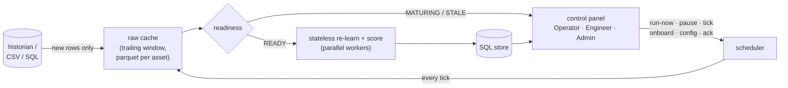

# ACM — Asset Condition Monitor

ACM watches industrial assets and tells you when something is wrong — **with
no labels, no training-data preparation, and no human tuning**. Point it at
any asset's raw sensor history (CSV or SQL): it learns what normal looks like
from t=0 (faults in the history included), sets its own alarm thresholds at
the cadence of your data, names the sensors driving every alarm, and retains
everything in SQL — human verdicts and the full data-science substrate.

## Install

```powershell
irm https://raw.githubusercontent.com/bhadkamkar9snehil/ACM/main/setup_acm.ps1 | iex
```

Installs Git/Python if missing, clones ACM, installs dependencies, and runs a
quiet self-test. SQL Server is optional — SQLite is the default store and
needs nothing installed.

## Run as a service (the intended way)

ACM is an always-on condition monitor. One process is both the scheduler and
the control panel:

```powershell
python scripts\acm_service.py                # SQLite store (default)
python scripts\acm_service.py --backend mssql --conn "DRIVER={ODBC Driver 18 for SQL Server};SERVER=host;DATABASE=ACM"
```

Open **http://localhost:8765**. The single-page panel has three persona
screens:

- **Operator** — fleet health now: state badges, trend sparklines, KPI strip,
  unacknowledged alarms with one-click acknowledge + note.
- **Reliability Engineer** — per-asset deep dive: fused score timeline with
  alarm shading and the self-tuned threshold, six-detector heat strip, culprit
  channels, alarm-episode history, daily stats.
- **Admin / ML Ops** — service health, run history and stage-by-stage logs,
  asset onboarding/retirement (CSV, SQL table, or query — source validated at
  onboarding), tick interval / pause / resume / run-now, and human-ops config
  editing with a full audit trail. ML parameters are not editable anywhere —
  they live in code and self-tune.

Every tick (default each 15–30 min, settable live) the service pulls **only
new rows** from each source into a local trailing-window cache (the historian
is never bulk-queried twice), gates each asset — `MATURING` until it has 14
days of history, `STALE` if the feed stops — then re-learns and scores every
ready asset in parallel from scratch. Stateless per tick: no model files, no
drift accumulation, nothing to corrupt; a crashed tick costs nothing. To run
at boot, register it once with Windows Task Scheduler ("At startup") or wrap
it with NSSM.



## One-shot use

```powershell
# Score one asset: history before the cutoff is the baseline, after is scored
python scripts\acm_run.py --csv pump7.csv --timestamp-col time --score-days 30 --report pump7.html

# Score a fleet in parallel into one SQL store
python scripts\acm_run.py --csv data\*.csv --score-days 30 --workers 3 --db acm_results.db --report fleet.html

# From / to SQL Server
python scripts\acm_run.py --backend mssql --conn "DRIVER={ODBC Driver 18 for SQL Server};SERVER=host;DATABASE=ACM" `
    --query "SELECT * FROM Historian WHERE EquipID=5010" --asset T10 --timestamp-col EntryDateTime --score-days 30

# Visualise: whole fleet, one group, or specific assets — full timeline
python scripts\acm_report.py --db acm_results.db --out report.html
python scripts\acm_report.py --db acm_results.db --assets PUMP7 --out pump7.html
python scripts\acm_report.py --db acm_results.db --list

# Keep the running config visible next to results
python scripts\acm_store.py sync-config --db acm_results.db

# Run the validation suites yourself
pytest tests\ -q                                  # injected-fault ML suite (~1 min)
python scripts\robustness_matrix.py               # asset-archetype x fault matrix
.\scripts\run_care_benchmark.ps1                  # public labelled wind-farm benchmark
```

If the asset has an operating-status column (0/2 = normal operation), pass
`--status-col` — it enables the availability rule (extended unplanned outage
detection).

## How it works


Six detector heads answer independent questions about every sample (sensor
dynamics, correlation structure, operating point, rarity, mode membership,
cross-prediction residuals). Calibrated scores are fused and passed to
self-tuned rules whose horizons are defined in **time** (1 h persistence,
24 h / 7 d rates, 48 h availability) and converted using the cadence inferred
from your data's own timestamps. Every alarm names its culprit channels.

## Validation

ACM's bar for ML completeness: **confidence in pre-detecting developing
abnormalities without false alarms, across varied kinds of assets, on raw
sensor data.** Three instruments, all reproducible from this repository:

1. **Robustness matrix** (`scripts/robustness_matrix.py`) — four synthetic
   asset archetypes with different physics (turbine, compressor, heat
   exchanger, noisy two-regime process) × five fault archetypes (drift,
   correlation break, intermittent, stuck sensor, step) × seeds, plus clean
   runs. Verdict requires ≥90% detection and ≥90% of clean runs quiet.
2. **Injected-fault test suite** (`tests/test_ml.py`, 22 tests) — guards every
   known failure mode of the pipeline: sensitivity, false-alarm resistance,
   detector health, degenerate channels, channel-role verification, rule
   self-tuning. Runs in about a minute, no SQL, no network.
3. **Public labelled data** — CARE-to-Compare Wind Farm A
   ([zenodo.org/records/15846963](https://zenodo.org/records/15846963)):
   **12/12 faults detected, 8/10 normal windows clean, F1 0.92**, cold-start,
   zero labels shown to the model. MetroPT-3 (raw metro-compressor signals
   with documented failures) via `scripts/download_validation_datasets.py`.

Detection floor, stated plainly: ACM targets **developing** faults — its
persistence horizon is one hour. Sub-hour transients are out of scope by
design.

## Results live in SQL

| Table/View | What it holds |
|---|---|
| `assets` | one row per asset: verdict, self-tuned thresholds, rules fired |
| `scores` | full timeline: fused + all six detector z-scores, status, alarm |
| `alarms` | contiguous alarm episodes with duration, peak, acknowledgement |
| `runs`, `run_log` | what ACM did, stage by stage — including culprit channels |
| `config`, `config_audit` | the human config (synced from file) and who changed what, when, why |
| `monitored_assets` | the service's asset registry: source, state, last run |
| `service_state` | scheduler state: paused, tick interval, last tick |
| `v_asset_now` | live monitor: one row per asset, current state, unacked alarms |
| `v_daily_stats` | data science: daily rates, availability, aggregates |

Identical schema on SQLite (default single file) and SQL Server
(`--backend mssql`). The HTML report renders any selection of assets with the
fused timeline, alarm shading, per-detector heat strip, and operations log.

## Repository map

```
core/                 the ML: pipeline.py (entry), alarm_rules.py, detectors,
                      fast_features.py, fuse.py, ml_defaults.py
scripts/
  acm_service.py      ALWAYS-ON service: scheduler + control panel (FastAPI)
  acm_feed.py         incremental historian pull, raw cache, readiness gate
  acm_run.py          one-shot scoring (CSV or SQL, parallel) -> SQL store
  acm_store.py        canonical store: SQLite / SQL Server, views, config sync
  acm_report.py       self-contained HTML reports, any asset selection
  robustness_matrix.py  asset-archetype x fault validation matrix
  care_benchmark.py   labelled wind-farm benchmark harness
  download_care_dataset.py / download_validation_datasets.py
static/               the control panel UI (vanilla JS + vendored uPlot, no CDN)
configs/config_table.csv   human settings only
tests/                test_ml.py (ML suite), test_store.py, test_service.py
setup_acm.ps1         one-command Windows setup
```
