# ACM — Asset Condition Monitor

ACM watches industrial assets and tells you when something is wrong — **with no labels, no training-data preparation, and no human tuning**. Point it at any asset's raw sensor history (CSV, SQL, OPC UA, or MQTT): it learns what normal looks like from the first tick, sets its own alarm thresholds, names the sensors driving every alarm, and retains everything in SQLite or SQL Server.

## Interface Preview

ACM features a fully responsive industrial control panel with **14 themes** — 5 dark, 9 light — across four tabs.

---

### Fleet Operator View

| Factory (dark) | Forge Dark | Solarised (light) |
|---|---|---|
| 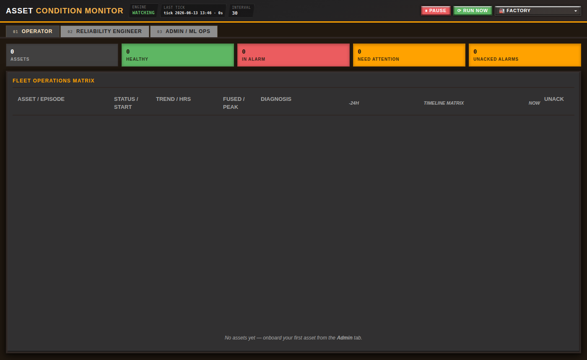 | 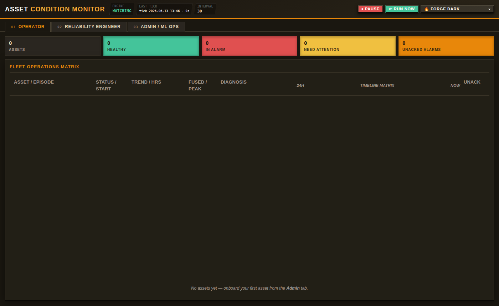 | 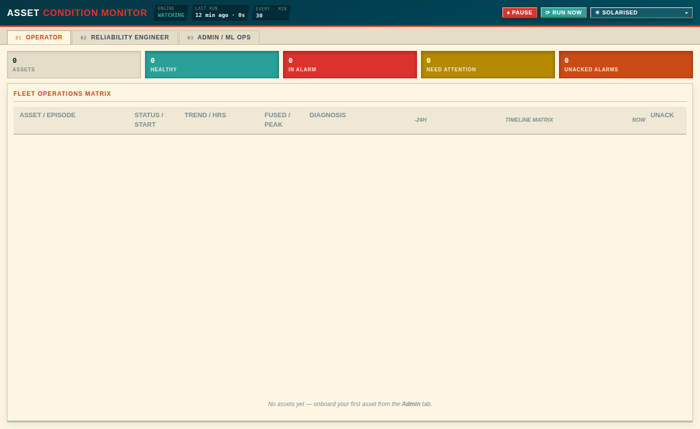 |

*Real-time fleet health KPIs, asset state badges, unified hierarchical alarm timelines, and one-click acknowledgments.*

---

### Reliability Engineer View

| Factory (dark) | Forge Dark | Solarised (light) |
|---|---|---|
| 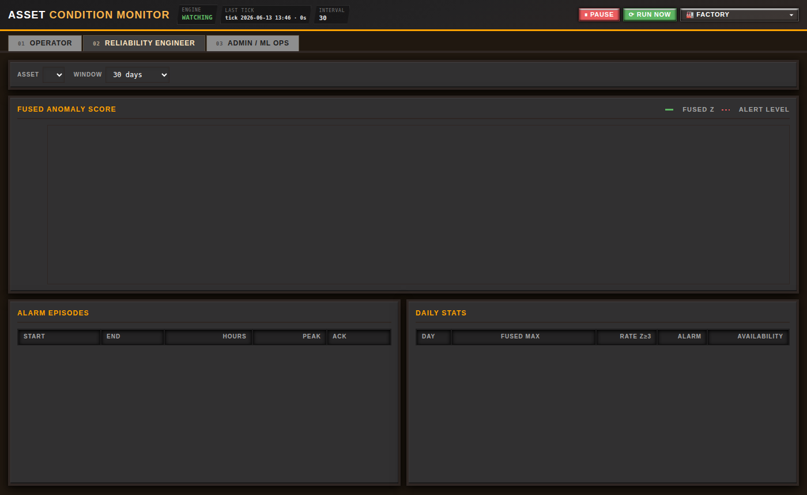 | 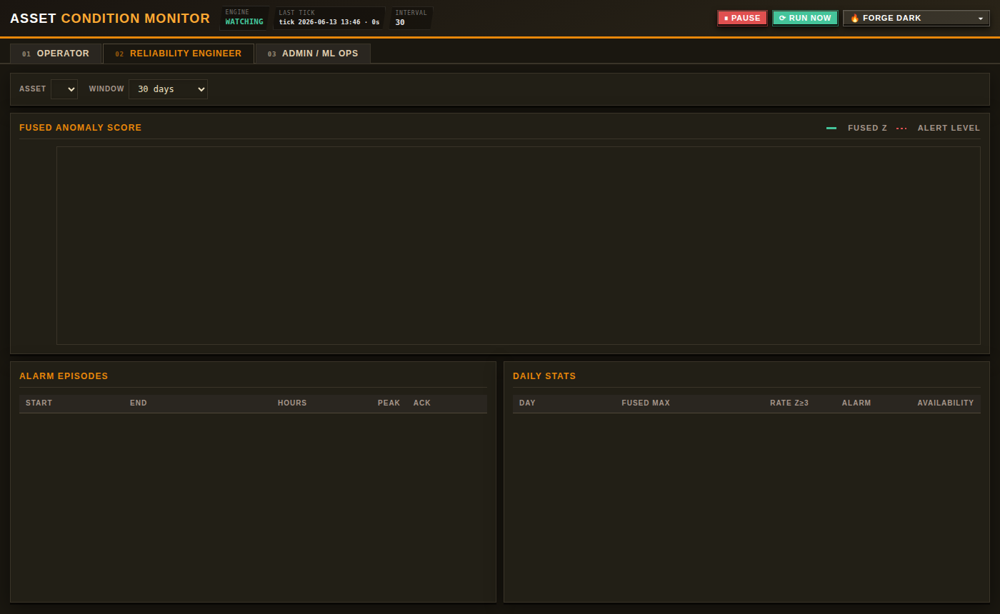 | 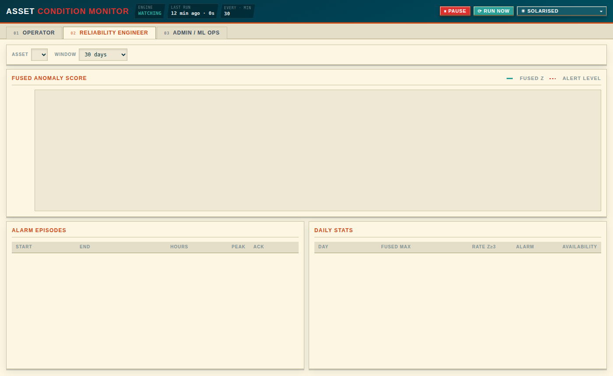 |

*Fused anomaly score chart, six-detector heatmap strip, culprit sensor ranking, and daily diagnostic stats.*

---

### Admin / ML Ops View

| Factory (dark) | Forge Dark | Solarised (light) |
|---|---|---|
| 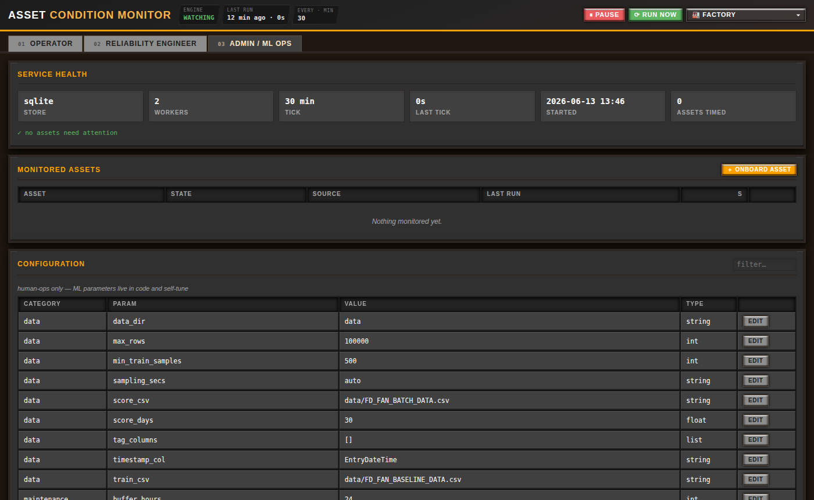 | 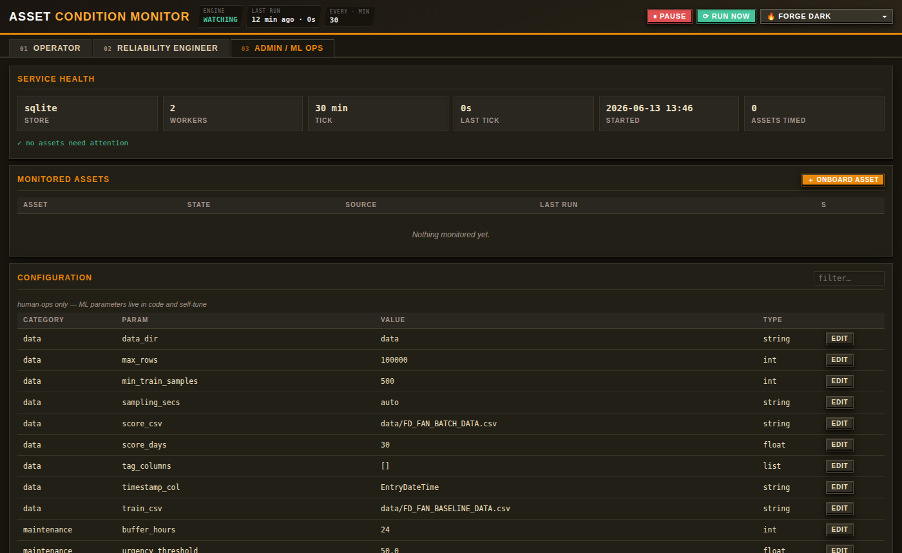 | 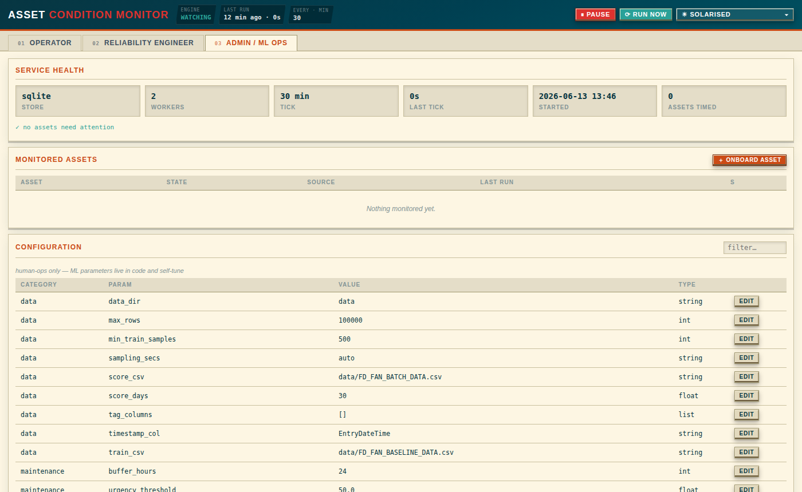 |

*Service health metrics, monitored asset registry, live configuration table with audit trail, and backend run logs.*

---

## Quick Start

### Windows

```powershell
irm https://raw.githubusercontent.com/bhadkamkar9snehil/ACM/main/setup_acm.ps1 | iex
```

### Linux / macOS

```bash
bash <(curl -fsSL https://raw.githubusercontent.com/bhadkamkar9snehil/ACM/main/setup.sh)
```

Both scripts are interactive and handle everything automatically:

| Automatic | Optional prompts |
|---|---|
| Git + Python 3.11+ (Windows only — auto-installs via winget or direct installer) | **[1/2] Industrial Simulator** — wire ACM to live OPC UA tag data for in-the-loop anomaly detection |
| Clone ACM to `~/ACM` | **[2/2] CARE demo data** — download 10 real wind-turbine SCADA events (~360 MB) so ACM can score them immediately |
| Install all Python dependencies | |
| Create runtime directories | |
| Detect SQL Server (falls back to SQLite) | |
| Verify all imports, run self-test | |

After setup:

```bash
# Start the service
python scripts/acm_service.py
# Open http://localhost:8765  →  Admin  →  Onboard assets
```

### Updating

Run the same one-liner again. The script detects your existing clone, pulls the latest, and upgrades dependencies. Your local databases (`acm_results.db`) are Git-ignored and are never touched.

---

## ML Pipeline

ACM scores every asset statelessly on every tick using six independent detectors, all calibrated out-of-sample, fused with correlation discounting, and routed through cadence-aware alarm rules.

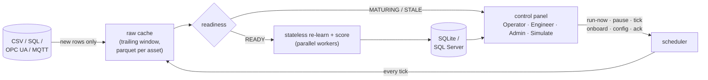

### Detectors

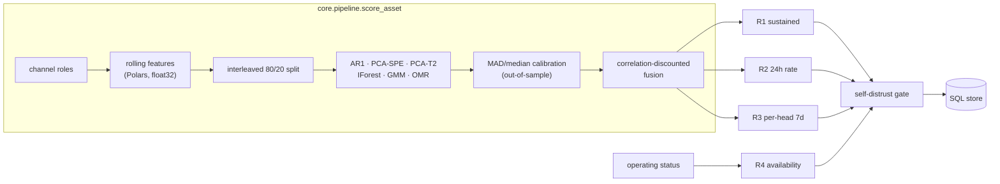

| Detector | What it catches |
|---|---|
| **AR1** | Slow drift — residuals from an auto-regressive fit on each sensor |
| **PCA-SPE** | Structural novelty — reconstruction error across all sensors |
| **PCA-T2** | Regime shift — Hotelling's T² in the principal component space |
| **IForest** | Transient spikes and outlier clusters |
| **GMM** | Mode changes — low-likelihood under the learned operating envelope |
| **OMR** | Per-sensor residuals — isolates which channel is misbehaving |

### Alarm Rules

ACM doesn't alert on every spike. The fused score is routed through four cadence-aware rules:

1. **R1 — Sustained anomaly**: score persistently high for a continuous duration (filters transient noise)
2. **R2 — 24-hour rate**: abnormal density of short-lived anomalies in a rolling 24-hour window
3. **R3 — Per-head 7-day rate**: one detector repeatedly firing over seven days (chronic degradation)
4. **R4 — Availability**: asset offline or silent for ≥ 48 hours
5. **Self-distrust gate**: fleet-wide simultaneous anomaly → likely sensor-grid issue, suppress false alarms

All thresholds are self-tuned from the history. No human configuration required.

---

## Simulate Tab

ACM includes an in-process industrial data simulator — no external services needed. The **Simulate** tab exposes three panels:

- **Generate** — 11 domain generators (rotary equipment, petroleum pipeline, gas pipeline, power plant, and six steel-plant process units). Each generator produces labeled CSVs with realistic fault signatures for use as demo data or benchmark input.
- **Files** — browse, upload, and inspect all CSV files in `sim_data/`. Click any file to see column types, a preview, and row/column counts.
- **Replay** — stream any CSV file as live tag data at configurable speeds, written to `data_cache/mqtt_buffer.db` for ACM to score on the next tick, exactly as if it were live MQTT or OPC UA data.

Ten fault datasets are pre-generated in `sim_data/sample/` so the Simulate tab is ready to use immediately after setup.

---

## Fault Datasets

Ten pre-generated CSVs in `sim_data/sample/` with known fault signatures:

| File | Domain | Scenario | Fault onset |
|---|---|---|---|
| `fault_rotary_bearing.csv` | Rotary equipment | Bearing fault | 40% mark |
| `fault_rotary_imbalance.csv` | Rotary equipment | Rotor imbalance | 40% mark |
| `fault_pipeline_small_leak.csv` | Petroleum pipeline | Small leak | 40% mark |
| `fault_pipeline_large_leak.csv` | Petroleum pipeline | Large leak | 40% mark |
| `fault_pipeline_pump_trip.csv` | Petroleum pipeline | Pump trip | 40% mark |
| `fault_pipeline_sensor_drift.csv` | Petroleum pipeline | Sensor drift | 40% mark |
| `fault_power_tube_leak.csv` | Power plant | Tube leak | 40% mark |
| `fault_power_condenser_fouling.csv` | Power plant | Condenser fouling | 40% mark |
| `fault_gas_compressor_trip.csv` | Gas pipeline | Compressor trip | 40% mark |
| `fault_gas_leak.csv` | Gas pipeline | Gas leak | 40% mark |

Each file has a `state` column: `NORMAL` for the first 40% of rows, then the fault label — making ground-truth evaluation trivial.

Regenerate at any time: `python scripts/generate_fault_dataset.py`

---

## CLI Usage

### Batch scoring

```bash
# Score one CSV, produce an HTML report
python scripts/acm_run.py --csv pump7.csv --timestamp-col time --score-days 30 --report pump7.html

# Score a fleet of CSVs in parallel
python scripts/acm_run.py --csv data/*.csv --score-days 30 --workers 4 --db acm_results.db --report fleet.html
```

### Generate a standalone HTML report

```bash
python scripts/acm_report.py --db acm_results.db --assets PUMP7 --out pump7.html
python scripts/acm_report.py --db acm_results.db --list
```

### CARE wind-farm benchmark

```bash
# Download 10 Farm A events (~360 MB)
python scripts/download_care_dataset.py --farms A --count 10 --sim-dir sim_data/sample

# Seed as ACM assets
python scripts/acm_seed_demo.py --care-dir sim_data/sample --db acm_results.db

# Run the benchmark against ground-truth labels
python scripts/care_benchmark.py --data-dir care_data --out results/A
```

---

## Repository Map

```
ACM/
├── core/
│   ├── pipeline.py          score_asset() — full ML pipeline, stateless, DataFrames in → result out
│   ├── alarm_rules.py       R1/R2/R3/R4 cadence-aware rules + self-distrust gate
│   ├── fast_features.py     rolling features via Polars (float32)
│   ├── fuse.py              correlation-discounted Z-score fusion + ScoreCalibrator
│   └── ml_defaults.py       all hyperparameters — edit here, never in config_table.csv
│
├── scripts/
│   ├── acm_service.py       FastAPI service + asyncio tick scheduler
│   ├── acm_feed.py          load_increment(), update_cache(), readiness(), frame_sensors()
│   ├── acm_store.py         Store class (sqlite/mssql), DDL, ingest_result(), sync_config()
│   ├── acm_run.py           batch CLI scorer — CSV/SQL → parquet cache → score → store
│   ├── acm_report.py        standalone HTML report generator
│   ├── acm_sim_routes.py    FastAPI router /api/sim/* — 14 routes for Simulate tab
│   ├── acm_seed_demo.py     idempotent seeder for CARE CSVs and OPC UA asset
│   ├── acm_opcua_bridge.py  asyncio singleton polling OPC UA → opcua_buffer.db
│   ├── acm_mqtt_bridge.py   daemon thread subscribing MQTT → mqtt_buffer.db
│   ├── download_care_dataset.py  partial Zenodo zip download via remotezip
│   ├── care_benchmark.py    CARE wind-farm benchmark against ground-truth labels
│   ├── generate_fault_dataset.py  generates 10 labeled fault CSVs
│   └── robustness_matrix.py       sensitivity / false-alarm matrix across fault types
│
├── sim/                     vendored simulator package (in-process, no external service needed)
│   ├── generator_registry.py   11 domain generators
│   ├── generator_engine.py     generate_csv()
│   ├── generators/             domain-specific generators
│   ├── simulator.py            SimulatorEngine (replay)
│   ├── buffer_publisher.py     BufferPublisher → mqtt_buffer.db (ACM reads this)
│   └── sim_adapter.py          SimAdapter facade used by acm_service + acm_sim_routes
│
├── static/
│   ├── index.html           single-page UI (Operator / Engineer / Admin / Simulate tabs)
│   ├── app.js               client-side polling, charts, API commands; SIM IIFE appended
│   └── style.css            14 themes (5 dark, 9 light)
│
├── configs/
│   └── config_table.csv     human-editable runtime config (categories: data, sql, runtime)
│
├── docs/
│   ├── ml-book.html         interactive ML reference book — every algorithm explained with demos
│   └── screenshots/         UI screenshots (factory / forge / solarised × operator/engineer/admin)
│
├── tests/                   pytest suite (68 tests across 4 files)
├── sim_data/
│   └── sample/              10 pre-generated fault CSVs + CARE wind-turbine events
│
├── setup_acm.ps1            one-command Windows installer + updater
└── setup.sh                 one-command Linux/macOS installer + updater
```

---

## SQL Schema Reference

| Table / View | Purpose |
|---|---|
| `monitored_assets` | Asset registry: source file/query, state (NEW/MATURING/READY/STALE), last runtime |
| `scores` | Full sensor timeline: fused score, six detector Z-scores, status, alarm flags |
| `alarms` | Contiguous alarm episodes: duration, peak, rule fired, acknowledgment comments |
| `assets` | Per-asset summary: current verdict, self-tuned thresholds, rules fired, alert stats |
| `runs` / `run_log` | Scheduler action log: processing speed, pipeline output, errors |
| `config` / `config_audit` | Live config and change history |
| `v_asset_now` | View: current state + unacknowledged alarms (Operator dashboard) |
| `v_daily_stats` | View: daily aggregates, availability rates, trends |

---

## Service Flags

```bash
python scripts/acm_service.py                          # SQLite default, port 8765
python scripts/acm_service.py --port 8766              # different port
python scripts/acm_service.py --db custom.db           # different database file
python scripts/acm_service.py \
    --backend mssql \
    --conn "DRIVER={ODBC Driver 18 for SQL Server};SERVER=host;DATABASE=ACM"
```

---

## Documentation

`docs/ml-book.html` — a self-contained interactive book covering every part of the ACM ML core: rolling features, all six detectors, calibration, fusion, and alarm rules, with working Chart.js demos and print-optimised layout. Open it in any browser.
