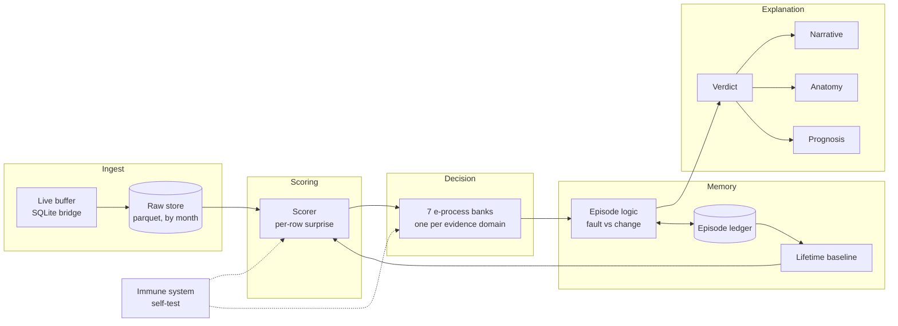
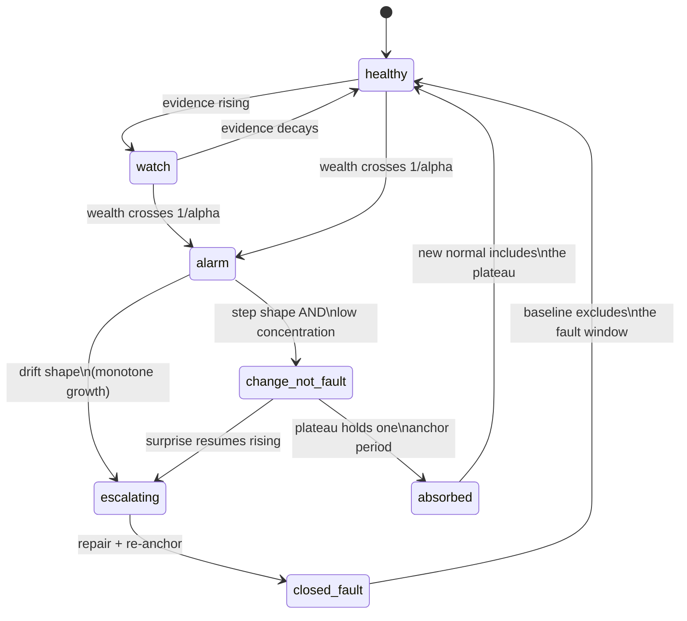
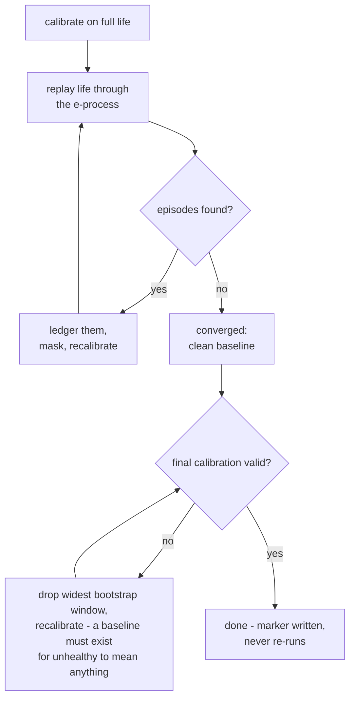
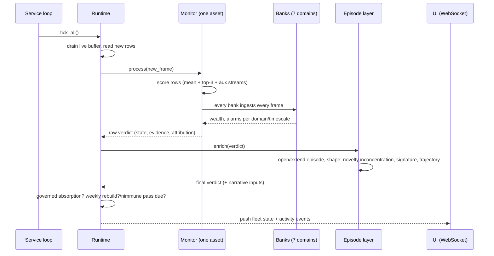

# How ACM Works - the complete explanation

This document explains everything ACM does, from first principles. It
assumes no prior knowledge of the system and no statistics background
beyond "mean" and "standard deviation" - every concept the system rests
on is built up on the page before it is used. Read it top to bottom
once; after that, each section stands alone as a reference.

Companion documents:
- `docs/src-file-guide.md` - what every file in `src/` does.
- `docs/testing-and-datasets.md` - how to test ACM and how to feed it
  new datasets.

---

## 1. The problem ACM solves

An industrial asset - a wind turbine, a pump, a furnace - streams
telemetry: temperatures, vibrations, pressures, flows, tens to hundreds
of channels, one row every few seconds or minutes, for years. Somewhere
in that stream, months from now, a bearing will start to fail. The
signal will be subtle at first: one channel drifting a little relative
to the others, a correlation weakening, a response getting sluggish.

The classical answers all have the same failure mode - **they need a
human in the loop somewhere**:

- **Fixed thresholds** ("alarm if temperature > 80C") need an engineer
  to pick the number per channel per asset, and go stale the moment
  operating conditions change.
- **Supervised ML** needs labeled fault examples, which do not exist
  for the faults that matter (each asset fails rarely, and differently).
- **Unsupervised anomaly scores** (autoencoders, isolation forests,
  one-class SVMs) produce a number - but no one can say what the number
  means. How high is "alarm"? The threshold on the score is just the
  fixed-threshold problem again, one level up. In practice these
  systems get tuned per site until the operator stops complaining,
  which silently destroys any statistical meaning the score ever had.

ACM's answer: the operator sets exactly one number, and it is not a
threshold or a sensitivity - it is a **promise**:

> `ALPHA_PER_ASSET_YEAR = 1.0` - "this system may raise at most one
> false alarm per asset per year, in expectation."

Everything else - every threshold, block size, baseline, and decision
boundary - is **derived from the asset's own data**, with the math
arranged so that the promise provably holds. That derivation chain is
what the rest of this document explains.

---

## 2. The shape of the system

Five layers, each with one job:

1. **Ingest** - raw telemetry lands in an append-only parquet store,
   partitioned by calendar month. Labels never enter it.
2. **Scoring** - a model of "normal" turns each raw row into a single
   *surprise* number: how far is this row from what the asset's own
   healthy history predicts?
3. **Decision** - surprise numbers are statistically meaningless one at
   a time. The decision layer accumulates them into *evidence* with a
   mathematical guarantee attached, and decides when evidence crosses
   into alarm.
4. **Memory** - alarms open *episodes*; episodes get classified (fault
   vs. legitimate operating change), closed into a permanent ledger,
   and the definition of normal is rebuilt from the ledger-masked life.
5. **Explanation** - every verdict carries its evidence trail, the
   channels responsible, a plain-language narrative, and its own
   falsification condition.

A sixth capability runs across all of them: the **immune system**,
which tests the deployed pipeline against injected faults so the system
knows - and reports - what it can and cannot detect.

One structural rule governs the whole design: **one asset, one world**.
Every asset has its own scorer, banks, episodes, and baseline; one
asset's tick never touches another's state. A fleet is N independent
monitors; a single asset is a fleet of one.

---

## 3. Layer by layer

### 3.1 Scoring: what is "surprise"?

The Tier 0 scorer (`scoring/surprise.py`, `ConditionalSurpriseScorer`)
is built on one idea: **a healthy machine's channels predict each
other**. Vibration follows RPM; pressure follows flow; bearing
temperature follows load. A fault is, before anything else, a *break in
those relationships* - a channel doing something the other channels say
it should not be doing.

Concretely, for each channel `j`:

1. **Standardize** every channel robustly: subtract the median, divide
   by the MAD (median absolute deviation). Medians and MADs are used
   instead of means and standard deviations because the healthy history
   may contain faults nobody labeled - robust statistics ignore a
   contaminated tail instead of being dragged by it.
2. **Fit a ridge regression** that predicts channel `j` from all the
   OTHER channels (never from its own past - see the tradeoff note
   below). Ridge = ordinary least squares plus a small penalty that
   keeps the weights stable when channels are correlated.
3. At scoring time, compute the **residual**: the actual standardized
   value minus what the other channels predicted, divided by the
   residual scale learned in training. This is the *residual z-score* -
   "how many typical-errors away from expected is this channel, right
   now, given everything else?"

A row's surprise is an aggregation of its per-channel residual
z-scores, and ACM deliberately uses **two aggregations at once**,
because they see different fault geometries:

- **Mean of |z| across channels** - the *magnitude* lens. Sensitive to
  diffuse deviations: many channels a little off at once (a regime the
  model never saw, a coordinated shift, widespread degradation).
- **Mean of the top-3 |z|** - the *channel-local* lens. A single broken
  channel moves the mean by only ~1/d on a d-channel asset (measured:
  a 3-sigma single-channel fault loses 94% of its separation by d=957),
  but it owns the top-3 no matter how wide the asset is. Top-3 rather
  than the single max, because a max is an extreme-value statistic
  whose *healthy* tail grows with channel count - it decalibrates on
  wide assets - while "three channels simultaneously elevated" is rare
  under noise but routine when one physical component genuinely breaks.

The scorer also produces, essentially for free:

- **PIT values** (probability integral transform): each residual mapped
  through its own training distribution. Under health these are uniform
  by construction, which makes them a continuous self-test - if PIT
  values stop looking uniform on *many* channels at once, the *model*
  is sick; on a *few* channels, the *machine* is sick there. That
  distinction is the boundary between the immune system and detection.
- **Attribution**: which channels carry the surprise (the top residual
  contributors), with magnitudes - this feeds the UI's channel chart
  and the anatomy layer.
- **Familiarity**: how close the current operating point sits to the
  training data, measured in the training set's own nearest-neighbor
  distance scale. Verdicts in barely-seen territory carry less
  confidence regardless of what the scores say.

**Tier 2** (`scoring/worldmodel.py`, `TorchWorldModel`) replaces the
linear ridge with one small neural network per channel (2-layer MLP
with quantile-regression heads), trained on GPU when the hardware tier
supports it. It catches *nonlinear* relationship distortions the linear
model reads as noise. Two deliberate design points: each network is
forbidden to see its own channel's history (a self-conditioned model
*tracks* a developing fault as the new normal instead of flagging it -
measured, not hypothesized), and its interface is contract-identical to
Tier 0 (same score/attribution/concentration/coverage methods), so the
verdict vocabulary never depends on the hardware tier.

For very wide assets there is a second Tier 2 architecture,
`MaskedWorldModel`: instead of d per-channel networks (whose compute
grows with the *square* of channel count), ONE shared trunk learns to
reconstruct any masked group of channels from the rest, with a mask
indicator distinguishing "unknown" from "at the median". A channel's
prediction is only ever read from the pass where that channel and all
its lagged copies were masked out of the input - the same
no-self-conditioning rule, enforced by construction (tests pin it
exactly: shifting a channel's values moves its residual one-for-one,
proving the prediction cannot see the shift). The mask partition is
fixed and seeded, so training and scoring see identical inputs and
scores are deterministic. It is deliberately not chosen automatically:
until it has earned detection parity on the real-data evidence lane, it
is reachable only by explicit override.

### 3.2 Decision: from surprise to evidence to alarm

This is the mathematical heart of ACM (`decision/eprocess.py`), and the
reason the one-dial promise is real rather than marketing. It is built
from three ideas that are each simple on their own.

**Idea 1 - conformal p-values: "how unusual is this, really?"**

Keep a *calibration sample*: a few thousand surprise scores from
held-out healthy history. When a new score `x` arrives, ask: *what
fraction of the healthy calibration scores are bigger than x?* That
fraction is a p-value. If the asset is still healthy - if today's
scores are statistically exchangeable with the calibration scores -
this p-value is uniformly distributed between 0 and 1. Nothing about
that statement assumes bell curves, independence models, or any
distributional shape. It is pure counting.

**Idea 2 - a betting martingale: "evidence that compounds"**

A single small p-value means nothing (healthy assets produce p = 0.01
one time in a hundred, by definition). Evidence must *accumulate*. ACM
runs a betting game: start with wealth 1; at each new p-value, multiply
wealth by a factor `e(p)` that is large when p is small and slightly
below 1 when p is unremarkable. The factor is chosen so that under
health (uniform p) its *expected value is exactly 1* - a fair game. A
healthy asset's wealth therefore drifts sideways-to-down forever. A
faulty asset produces a stream of small p-values, and the wealth
*compounds* - this is what "accumulating evidence" means, literally.

**Idea 3 - Ville's inequality: "watch forever, free of charge"**

For any fair game of this kind, the probability that wealth *ever* -
at any point in an infinite future - reaches `1/alpha` is at most
`alpha`. That is Ville's inequality, and it is what makes the promise
anytime-valid: ACM checks the wealth on every tick, forever, and the
false-alarm probability is still bounded by alpha. There is no
"multiple testing correction", no "you looked too often" penalty. The
alarm rule is simply: **wealth >= 1/alpha => alarm.** The UI's
"evidence" number is exactly `log(wealth) / log(1/alpha)` - evidence
1.0 IS the alarm line.

Three engineering consequences follow, and each is load-bearing:

- **Blocks, derived not chosen.** Real surprise streams are
  autocorrelated (this second's score resembles last second's), which
  breaks the exchangeability that makes p-values uniform. ACM
  aggregates scores into blocks - the mean of B consecutive scores -
  where B is the asset's own measured *decorrelation length* (the
  smallest lag at which the score autocorrelation dies out). Never a
  hardcoded window.
- **The exchangeability audit.** When the calibration is too short to
  even find its decorrelation length, or the correlation never decays
  within what the history can support, no valid block exists - and the
  bound would silently become fiction (measured: 4x the promised
  false-alarm rate on a short autocorrelated calibration, and 8x when
  a whitened calibration sample was paired with the correlated live
  stream). ACM's policy: **refuse the indefensible, disclose the
  marginal.** Strong residual correlation at the largest supportable
  block => the bank refuses to arm and the asset honestly reports
  `insufficient-history` (more history genuinely cures it). Mild
  residual correlation => the bank arms but records the residual
  autocorrelation, and the UI shows the guarantee as *qualified*
  rather than pretending it is clean.
- **A bank per timescale, alarms that latch.** Fault physics spans
  minutes to months, so each evidence domain runs a small bank of
  e-processes at geometrically spaced block sizes (B, 4B, 16B), each
  funded with an equal slice of the domain's budget. And once wealth
  crosses the line, the alarm **latches** - it does not clear when
  scores quiet down, because a supermartingale restarted on the same
  calibration would silently spend the alpha budget twice. Only the
  episode layer, by closing an episode and re-anchoring the baseline,
  resets the game - and the budget accounting is per re-anchor period,
  which is what converts the *yearly rate* dial into the *per-game
  probability* Ville's inequality needs.

**The budget ledger.** The total promise is split across the evidence
domains by union bound - the shares sum to exactly 1.0 (pinned by
test), so the whole system's false-alarm rate is bounded by the one
dial no matter which domain fires:

| Domain | Share | Failure geometry it watches |
|---|---|---|
| magnitude | 0.40 | diffuse / many-channel deviation (mean lens) |
| channel-local | 0.10 | single-channel faults the mean dilutes (top-3 lens) |
| availability | 0.15 | standstill: flat, dead, or gap-ridden telemetry |
| horizon-gap | 0.10 | slow drift a tracking model would hide (long- minus short-horizon surprise) |
| predictability-band | 0.05 | too erratic OR too regular (both directions are pathologies) |
| transient-response | 0.10 | the machine responding differently to the same excitation |
| dynamics-drift | 0.10 | the learned one-step dynamics operator changing shape |

### 3.3 Episodes: is it a fault, or did the machine just change?

The e-process layer answers "is this surprising, persistently?" It
cannot answer the question an operator actually cares about: *is the
machine breaking, or did someone legitimately change how it runs?* A
new setpoint, a seasonal regime, a product change - all read as
sustained surprise against the old normal. A system that alarms on
every operating change is a system that gets turned off.

The episode layer (`episodes.py`) sits on top of the alarm signal and
runs this lifecycle:

When the first alarming verdict arrives, an episode opens - back-dated
to the measured *onset* (a robust changepoint in the surprise stream,
not the start of the data frame). While it is open, three measurements
run continuously:

- **Shape** (`novelty.py`): is the surprise stream *drifting* (monotone
  growth - fault-like: things that are breaking keep breaking),
  *stepped* (jump then plateau - change-like: the machine moved to a
  new operating point and stayed there), or just noisy? Measured with
  a rank-correlation trend test, immune to the stream's scale.
- **Concentration** (from the scorer): what fraction of the total
  surprise lives in the top few channels? A genuine local fault is
  concentrated (one component is breaking); a legitimate operating
  change is coordinated (every channel moved together, consistently
  with their trained relationships). Shape alone cannot make this
  call - a constant-severity fault and a setpoint change both plateau -
  so concentration is the corroborating axis, and BOTH are required to
  downgrade an alarm to change-not-fault.
- **Novelty** (`novelty.py`): has this asset's surprise stream ever
  looked like this before? Computed as a matrix-profile-style distance
  between the current episode's shape and the entire remembered life,
  with an amplitude component (a z-normalized shape match alone is
  blind to "same shape, unprecedented size" - measured failure,
  fixed). Novelty enriches the verdict and powers recognition; it
  never vetoes an alarm.

An episode classified `change-not-fault` is not silently dropped - that
would just be a smarter way of ignoring evidence. Instead it is
**absorbed, governed**: if the new plateau holds for one full re-anchor
period (about a week), the episode closes into the ledger *as a
change*, and the baseline is rebuilt with the adjudicated plateau
included in the definition of normal. If the classification was wrong,
the falsifiability net catches it: surprise resumes against the new
baseline and a fresh episode opens. Fault episodes never absorb - the
definition of normal does not move while evidence of degradation is
accumulating.

Every closed episode - fault AND absorbed change - lives permanently in
the **ledger**, which gives the asset a case history. Two kinds of
recognition run against it on every open episode: **signature matching**
(same channels, same shape as a past episode => "seen before, resolved
as X") and **trajectory matching** (the current surprise trajectory
overlaid on past episodes' trajectories => "tracking the 2025 bearing
failure; that one peaked in ~3 weeks") - case-based prognosis from the
asset's own history.

### 3.4 Memory: the definition of normal

Everything above depends on one reference: *what does healthy look
like for this asset?* Getting that reference wrong is the single most
common way monitoring systems die, and ACM's memory layer
(`memory/baseline.py`, `memory/ledger.py`, `memory/summaries.py`)
exists to prevent the three classic deaths:

- **The boiling frog.** A trailing window (last 180 days) slowly
  absorbs a slowly developing fault - by the time it is severe, it IS
  the baseline. ACM builds normal from the asset's **entire life**,
  with the recent window's total influence arithmetically capped at
  20% (`RECENCY_CAP`). A drift in the last months can never own the
  definition of normal, no matter how slow it is.
- **Fault contamination.** Historical fault periods poison the
  baseline. Every ledgered fault window is **masked out** of every
  baseline computation, forever. (Absorbed *changes* are deliberately
  NOT masked - they are adjudicated new-normal.)
- **First-contact contamination.** The very first calibration sees the
  raw, unlabeled life - including any faults already in it, with no
  ledger to mask them yet. The **bootstrap** solves this iteratively:

Because lifetime history outgrows what calibration needs, the
calibration sample is downsampled - and *how* matters: it is built
from **consecutive chunks** spread evenly across the older life, never
by taking every k-th row. Row-striding whitens the sample, which made
the derived block sizes wrong for the fully-correlated live stream
(measured: 8x the promised false-alarm rate). Chunks keep the sample
statistically representative of the stream the banks will actually
consume; spreading them across the life keeps seasonal coverage.

Performance note: lifetime statistics are not recomputed from raw data
on every rebuild. Each closed calendar month is summarized once
(count/mean/variance/quantile-sketch per channel) into a cache keyed by
the ledger state; rebuilds merge summaries - exact for moments, within
sketch error for quantiles - and only the open month touches raw rows.

### 3.5 Explanation: anatomy, prognosis, narrative

**Anatomy** (`anatomy.py`). The fitted scorer's coefficients ARE the
machine's dependence structure - which channels drive, which follow,
which move together. ACM makes that structure first-class: it refits
the scorer on five random half-samples and keeps an edge between two
channels only if it shows up strongly in at least 80% of the refits
(*stability selection* - dense SCADA correlation hallucinates edges,
and only structure that survives resampling is trusted for root-cause
claims). Connected components of the surviving graph are **organs** -
the machine's subsystems, discovered without an engineering drawing.
Per-organ surprise turns "channel 412 is anomalous" into "the pitch
subsystem is degrading", and the organ whose elevation began *first*
in an episode is the root-cause candidate - always presented as
corroboration with the onset order shown, never as standalone proof.

**Prognosis** (`prognosis.py`, `scoring/horizons.py`). Two different
jobs with confusingly similar names. `scoring/horizons.py` generates
*evidence* (the horizon-gap and predictability-band streams in the
domain table above). `prognosis.py` consumes an escalating episode's
health-index trajectory, fits a drift-plus-noise degradation model
(Wiener process), and produces a full **failure-time distribution**
(inverse Gaussian first-passage time) with honest quantiles - "median
19 days, 80% between 11 and 34". It is self-gating: no horizon is shown
unless the trend is statistically real, the trajectory long enough, and
the drift positive; and the critical level comes from the asset's own
past alarm onsets when the ledger has any, with a clearly-flagged
provisional default when it does not. *Never show an uncalibrated
horizon; never hide a calibrated one.*

**Narrative** (`narrative.py`). Every verdict is rendered as a short
plain-language story: the judgment sentence, then one section per piece
of evidence (what the evidence is, where it sits anatomically, what
shape it has, what the horizon says, how familiar the territory is) -
and always, at the end, **what would falsify this verdict**. The
falsification clause is a design signature: a monitoring system that
cannot say what would change its mind is asking for faith, not trust.

### 3.6 The immune system: does the watchman work?

A monitoring system's worst failure is silent: a dead scorer reads as
a perfectly healthy fleet. ACM tests itself (`immune/`), per asset, on
a weekly staggered schedule, with no labels needed:

- **Sensitivity profile** (`immune/harness.py`, `immune/inject.py`):
  inject four canonical fault classes - drift, step, variance change,
  correlation break - into the asset's own held-out healthy data, at a
  ladder of magnitudes (0.5 to 4 sigma), and record what the pipeline
  catches. The result is the asset's honest **detection floor**: "I
  will see a 1-sigma drift; I will not see a 0.5-sigma one." The
  correlation-break injection is the subtle one: it permutes values so
  every marginal distribution stays *exactly* the same and only the
  relationships break - precisely the fault class the conditional
  scorer exists to catch.
- **Rehearsal** (`immune/rehearsal.py`): the harsher sibling. Instead
  of perturbing one channel in isolation, it seeds a fault and
  propagates the response through the scorer's own learned coupling
  structure, so the synthetic fault is physically coherent - and
  harder to detect, because the coupled response partially explains it
  away. This maps the honest detection boundary, not the flattering
  one.
- **Conformance**: a clean holdout must NOT alarm - the false-alarm
  promise, spot-checked empirically.
- **Degeneracy**: near-zero variance or too few distinct score values
  means the live scorer is dead, whatever the recipe profile says.
- **PIT distortion** (from 3.1): distortion across many channels
  indicts the model, not the machine - but only evaluated while NOT
  alarmed, because during a genuine severe fault the distortion
  spreads through physically coupled channels and reads model-sick.

A sick immune result drops confidence and triggers an automatic
rebuild. The results - floors per fault class, the detection-profile
heatmap, rehearsal floors per channel - are all surfaced in the UI.

---

## 4. The life of one tick

Notable invariants in that flow:

- **Every bank ingests every frame.** Which domain gets *named* on the
  verdict is a priority decision made afterwards; the evidence itself
  is never lost to attribution ordering (a dynamics alarm must not
  starve the band bank of the data that proves the fault).
- **Scheduled work is staggered per asset** (rebuilds, immune passes)
  via a stable hash, so a thousand-asset fleet does not rebuild
  everything on the same tick.
- **Rebuilds never run during an open episode** - the definition of
  normal does not move while evidence is accumulating.
- The service loop is guarded: a failing tick is logged and retried
  next interval; a dead loop is visible in staleness, never silent.

---

## 5. Architectural decisions and tradeoffs

These are the deliberate choices, with what was paid for each.

**One dial, zero config.** There is no config file, no per-site table.
Every "tunable" is either derived from the asset's data or is a
structural constant with a written rationale in `constants.py`.
*Tradeoff:* when a deployment genuinely needs different behavior, the
answer is code + a recorded rationale, not a knob - slower, on purpose:
knobs are where statistical validity goes to die.

**Guarantee over sensitivity.** When validity cannot be established -
short history, undecomposable correlation - ACM refuses to arm
(insufficient-history) or arms with a disclosed qualification, rather
than silently degrading. *Tradeoff:* some assets sit unmonitored (or
qualified) longer than an aggressive system would; ACM considers a
false guarantee strictly worse than a late start.

**Two aggregation lenses instead of one.** Mean and top-3 both feed
banks, splitting the budget, because each is blind to the other's
geometry. *Tradeoff:* the magnitude domain gave up 20% of its budget
(0.5 -> 0.4), raising its alarm threshold by log(1.25) - a few percent
in log-wealth terms - to buy visibility of single-channel faults on
wide assets.

**Latching alarms.** Once crossed, an alarm holds until an episode is
adjudicated and the baseline re-anchored. *Tradeoff:* no automatic
all-clear when scores quiet down; the payoff is that the alpha budget
is spent honestly (a self-resetting martingale double-spends it) and
that flapping alarms - the fastest way to lose an operator's trust -
are structurally impossible.

**Lifetime memory with a recency cap, not a trailing window.**
*Tradeoff:* baselines must be amortized (monthly summary caches) to
stay cheap, and genuinely new normals need explicit absorption instead
of being silently aged in - which is exactly the point.

**Absorption is governed, not automatic-on-classification.** A
change-not-fault plateau must hold for a full anchor period before the
baseline moves, and an absorption IS an anchor (so the per-anchor alpha
accounting stays exact). *Tradeoff:* a real operating change reads
"change-not-fault" for about a week before the system fully accepts
it.

**Per-channel models, not one joint model.** Both tiers model each
channel from the others rather than fitting one joint density.
*Tradeoff:* d models instead of one; the payoff is per-channel
residuals (attribution, PIT, anatomy all need them) and graceful
behavior when channels appear/disappear.

**Self-history exclusion in the world model.** Each channel's network
may not see that channel's own lags. *Tradeoff:* a weaker one-step
predictor; the payoff is measured, not theoretical - a self-conditioned
model *tracks* a developing fault and hides it (separation 1.28 vs
2.65 without self-history on the same injected fault).

**Zero-build UI.** One HTML file, vendored libraries, no bundler - the
whole front end works air-gapped and deploys by copying one directory.
*Tradeoff:* no npm ecosystem; the UI uses a small vendored vdom
(Preact+htm) instead.

**Honest states over forced verdicts.** `insufficient-history` and
`change-not-fault` are first-class verdict states, not error codes.
The vocabulary: healthy, watch, alarm, escalating, change-not-fault,
insufficient-history - each with its own falsification clause.

## 6. Known limits (current, honest)

- **Confidence is a placeholder formula** (calibration volume times
  familiarity) - useful ordering, not a calibrated probability yet.
- **Large coordinated operating changes** can transiently alarm before
  being reclassified and absorbed (measured on a 3-sigma coordinated
  shift: two alarming ticks before self-correction). The corroboration
  margin for very large coordinated moves is an open design question.
- **The Tier 2 sensitivity profile is measured on the Tier 0 recipe**;
  only the rehearsal harness exercises the live neural scorer's actual
  detection boundary.
- **Familiarity in very high dimension** relies on nearest-neighbor
  distances, which concentrate as channel count grows; on very wide
  assets it degrades toward uninformative-but-harmless.
- **Qualified guarantees are disclosed, not repaired**: residual
  block-scale correlation below the refusal floor can inflate the
  realized false-alarm rate up to ~2-3x until more history accumulates.
