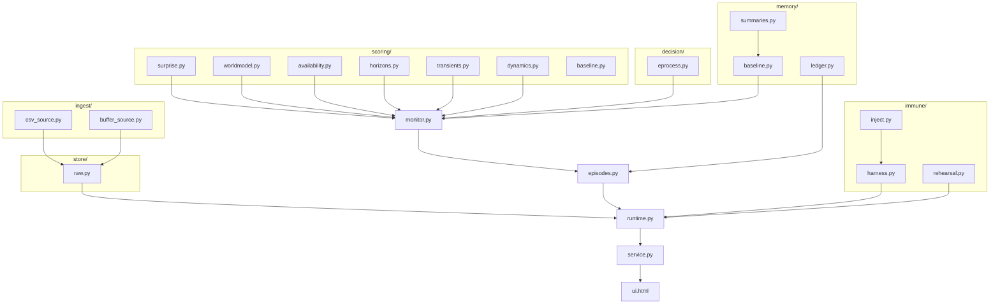

# src/ file guide

One entry per file: what it does and what lives in it. Reading order for
a newcomer: `constants.py` -> `decision/eprocess.py` ->
`scoring/surprise.py` -> `monitor.py` -> `episodes.py` -> `runtime.py`.
The full conceptual walkthrough is `docs/how-acm-works.md`.

## Top level

- **`constants.py`** - the config spine. `ALPHA_PER_ASSET_YEAR` (the one
  dial) plus a registry of structural constants, each carrying a written
  rationale. There is deliberately no config file anywhere else.
- **`verdict.py`** - the frozen verdict contract: the `Verdict`
  dataclass (state, evidence, confidence, attribution, evidence trail,
  coverage, model epoch, falsifiable-by), the state vocabulary, and the
  interim confidence formula. Fields never change; later layers enrich
  values.
- **`monitor.py`** - `AssetMonitor`, the per-asset spine: owns the
  scorer plus one e-process bank per evidence domain, the alpha-share
  split (shares sum to exactly 1.0, pinned by test), both calibration
  paths (cold-start split and lifetime), and `process()` - the
  tick-to-verdict function. Also `render_report()` (the markdown fleet
  report).
- **`episodes.py`** - `EpisodicMonitor`, wrapping `AssetMonitor` with
  episode lifecycle: onset back-dating, shape/novelty/concentration
  measurement, fault vs change-not-fault classification, signature and
  trajectory matching against the ledger, re-anchor and governed
  absorption, and the rolling health index.
- **`novelty.py`** - the novelty engine: FFT-based matrix-profile-style
  distance of the current surprise stream against the remembered life
  (shape + amplitude components), and `classify_shape()` (drift / step /
  noisy via rank-correlation trend).
- **`anatomy.py`** - learned machine anatomy: stability-selected channel
  dependency graph from the scorer's coefficients, connected-component
  organs, per-organ surprise, and episode origin (which organ elevated
  first).
- **`prognosis.py`** - failure-time estimation: robust Wiener-process
  drift fit on the health index, inverse-Gaussian first-passage
  distribution, self-gating (no trend / thin data / negative drift =>
  no horizon shown), critical level from the asset's own ledgered
  onsets.
- **`narrative.py`** - renders a verdict (plus its previous verdict and
  immune status) into plain-language sections, ending with the
  falsification clause.
- **`runtime.py`** - the fleet host: N independent monitors, onboarding
  with a fingerprinted monitor cache, the first-contact bootstrap
  (detect -> mask -> re-detect), per-tick orchestration (live-buffer
  drain, scoring, governed absorption, staggered weekly rebuilds and
  immune passes), the activity stream, and the aggregate fleet summary
  (including the alpha budget ledger).
- **`scheduler.py`** - thin async fleet scheduler used by the service
  loop.
- **`service.py`** - FastAPI app: JSON API, WebSocket push, the
  self-ticking guarded loop, vendored-asset serving, and the CLI
  entrypoint (`python -m service`).
- **`hardware.py`** - hardware probe (CPU/RAM/GPU) -> tier selection
  (T0/T1/T2-S/T2) -> resource governor (worker and BLAS-thread caps);
  per-asset tick cost telemetry.
- **`ui.html`** - the entire front end: one file, zero build. Preact +
  htm (vendored) for rendering, ECharts (vendored) for charts,
  WebSocket-live with polling fallback.
- **`_version.py`** - the package version (also part of the monitor
  cache fingerprint: a monitor pickled by different code is never
  trusted).

## decision/

- **`eprocess.py`** - the validity keystone. Conformal p-values against
  a healthy calibration sample; the betting-martingale e-process;
  Ville's inequality as the alarm rule; block sizes derived from the
  measured decorrelation length; the exchangeability audit (refuse the
  indefensible, disclose the marginal); the multi-timescale
  `EProcessBank` with union-bound budget split; latching alarms.

## scoring/

- **`surprise.py`** - `ConditionalSurpriseScorer` (Tier 0): robust
  standardization, per-channel ridge reconstruction from the other
  channels, residual z-scores, the mean lens (`score`) and the top-3
  channel-local lens (`score_topk`), PIT values + distortion
  classification, attribution with magnitudes, operating-point
  familiarity, concentration.
- **`worldmodel.py`** - `TorchWorldModel` (Tier 2): one small MLP per
  channel with quantile heads (pinball loss), self-history excluded by
  design, grouped-batch GPU training with per-channel early stop;
  contract-identical interface to Tier 0.
- **`availability.py`** - the standstill lens: fraction of channels
  whose rolling variance collapsed against their CALIBRATED live scale,
  plus cadence-gap detection.
- **`horizons.py`** - `MultiHorizonScorer`: per-horizon ridge maps; the
  horizon-gap stream (long minus short horizon surprise - early warning
  for slow drift) and the bilateral predictability band (too erratic or
  too regular).
- **`transients.py`** - transient-response catalogue: how the machine
  responds to its own recurring excitations, scored for response-shape
  change.
- **`dynamics.py`** - dynamics-drift: DMD-style one-step operator
  re-identification over non-overlapping windows; relative Frobenius
  distance from the healthy reference operator.
- **`baseline.py`** - `RobustZScorer`: the simple per-channel robust
  z scorer (auxiliary / fallback recipe).

## memory/

- **`baseline.py`** - `LifetimeBaseline`: definition of normal from the
  entire ledger-masked life with the recency cap; cached per-month
  summaries; the calibration sample built from consecutive chunks
  (never row-striding).
- **`ledger.py`** - the episode ledger: append-only episode records
  (fault AND absorbed change), window queries, and frame masking.
- **`summaries.py`** - mergeable per-period channel summaries
  (count/mean/variance/quantile sketch): exact moment merging, bounded
  quantile error.

## immune/

- **`harness.py`** - the sensitivity profile: canonical fault classes
  injected at a magnitude ladder into held-out healthy data; detection
  floors; conformance and degeneracy checks; `run_immune_check`.
- **`inject.py`** - the injectors: drift, step, variance, and
  correlation-break (marginals preserved exactly, relationships
  destroyed).
- **`rehearsal.py`** - counterfactual rehearsal: coherent fault
  synthesis through the learned coupling structure; per-channel
  detection floors on the live pipeline; honest skip when a valid bank
  cannot be built.

## store/ and ingest/

- **`store/raw.py`** - the raw store: append-only parquet, one
  directory per asset, calendar-month partitions, timezone-aware UTC
  timestamps enforced at the door, column-order-insensitive reads.
- **`ingest/csv_source.py`** - CSV adapter into the store (delimiter
  sniffing, timestamp declaration).
- **`ingest/buffer_source.py`** - live SQLite buffer source: any bridge
  that writes `(ts, payload_json)` rows feeds the asset on every tick.

## evidence/

- **`evidence/care_replay.py`** - the evidence lane: replays CARE-shaped
  farm datasets through the full production path and scores the verdicts
  against ground-truth labels (see `docs/testing-and-datasets.md`).
- **`evidence/soak.py`** - the operational soak: runs the real service
  against a time-compressed live feed through healthy -> change ->
  fault phases and checks eight pass/fail criteria.
