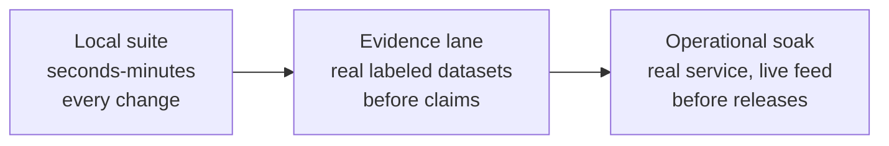

# Testing ACM and feeding it datasets

Three layers of testing, in increasing order of realism and cost:



---

## 1. The local suite

```bash
uv run pytest tests/ -q                      # everything (~3-4 min)
uv run pytest tests/ -q -m "not statistical" # skip the heavier statistical tests
uv run pytest tests/test_eprocess.py -q      # one layer at a time
```

What each file pins down:

| File | What it proves |
|---|---|
| `test_eprocess.py` | the false-alarm bound actually holds (empirical Ville conformance on autocorrelated data), block derivation, the exchangeability audit (refusal + disclosure), budget union bound, latching |
| `test_surprise.py` | the conditional scorer: correlation-break detection, PIT uniformity, robustness |
| `test_monitor_e2e.py` | tick-to-verdict end to end; alpha shares sum to 1.0; the channel-local lens catches what the mean dilutes |
| `test_novelty_episodes.py` | episode lifecycle, shape classification, change-not-fault, absorption |
| `test_memory.py` | lifetime baseline, recency cap (the boiling-frog test), ledger masking, consecutive-chunk calibration sampling |
| `test_anatomy.py` / `test_prognosis.py` / `test_horizons.py` / `test_transients.py` / `test_dynamics.py` | each explanation/evidence module against synthetic ground truth |
| `test_immune.py` / `test_rehearsal.py` | the self-test: injected faults get caught, clean data conforms, dead scorers are flagged |
| `test_runtime_service.py` | fleet runtime + API + WebSocket + bootstrap convergence + immune passes, at fleet scale |
| `test_raw_store.py` | store contract: UTC enforcement, month partitions, column-order insensitivity |
| `test_worldmodel.py` | Tier 2 (skipped automatically when torch is absent): PIT calibration, the nonlinear go/no-go separation criterion, cross-tier contract parity |
| `test_care_replay.py` | the evidence-lane machinery itself, on a tiny synthetic CARE-shaped farm |
| `test_seed_demo.py` | the live-seeding path (#131): one asset per event, no meta/label columns, no train/prediction split |
| `test_ascii.py` / `test_import_boundary.py` | repo hygiene |

Conventions: tests marked `statistical` run repeated-trial probability
checks (slower, seeds fixed - not flaky). Torch-dependent tests skip
cleanly on CPU-only machines.

---

## 2. What shape does ACM want?

ACM's entire input contract is small. An asset is a stream of rows:

- **one timestamp column** - timezone-aware UTC (`datetime[us, UTC]`).
  Naive timestamps are REJECTED at the store door, never guessed: the
  adapter that knows the dataset's documented timezone must declare it.
- **numeric channel columns** - any names, any count >= 2. Channels may
  appear or disappear between rows (matched by name, never by column
  order).
- **nothing else.** No labels, no status flags, no fault annotations -
  labels must never enter the raw store. Keep them outside for
  evaluation only.

Cadence can be anything from seconds to hours; ACM measures what it
needs (decorrelation lengths, cadence gaps) from the data itself.

How much history before it speaks: the monitor arms when the healthy
calibration supports a valid guarantee - as a rule of thumb, a few
thousand rows spanning at least a few weeks. Until then the asset
reports `insufficient-history`, which is a working state, not an error.
Assets whose history cannot support the guarantee (too short, or
correlation the history cannot decompose) stay in that state and say
why.

### Seeding a dataset programmatically

```python
import polars as pl
from store.raw import RawStore, TIMESTAMP_COL

store = RawStore("acm_data/raw")
frame = pl.DataFrame({
    TIMESTAMP_COL: pl.Series(timestamps, dtype=pl.Datetime("us", "UTC")),
    "temp": temp_values,
    "vib": vib_values,
    # ... any numeric channels
})
store.append("plant/asset-01", frame)   # slash-namespaced asset keys
```

Then either start the service (`uv run python -m service --root
acm_data`) - it discovers every asset in the store, onboards, and
bootstraps automatically - or drive it in-process (see
`tests/test_runtime_service.py` for the pattern).

### Live feeds

Any bridge that writes rows into a SQLite buffer table with columns
`(ts, payload_json)` - where `payload_json` is
`{"published_at": ..., "channel": value, ...}` - can feed an asset:

```bash
uv run python -m service --root acm_data \
  --live "plant/asset-01=bridge_buffer.db"
```

The buffer is drained into the store on every tick.

---

## 3. The evidence lane: real labeled datasets

The evidence lane exists to answer "does ACM actually detect real
faults on real machines?" with ground truth - and its results are
regression evidence, never tuning targets. The standing rule: no
parameter is ever adjusted to improve a benchmark number.

### The CARE-shaped farm layout

The replay runner consumes datasets in this on-disk shape (the shape of
the public CARE-to-Compare wind-farm dataset):

```
<farm_dir>/
  event_info.csv            # one row per event (see columns below)
  datasets/
    <event_id>.csv          # one file per event
```

`event_info.csv` columns: `event_id`, `event_label` ("anomaly" or
"normal"), `event_start` (timestamp - when the labeled fault begins),
`event_description` (free text).

Each `datasets/<event_id>.csv`: a `time_stamp` column, a `train_test`
column ("train" rows = the healthy history ACM onboards on;
"prediction" rows = the scored window), and numeric sensor columns.
Semicolon OR comma delimited (sniffed). Meta/label columns
(`status_type_id`, `train_test`, `id`, `asset_id`) are stripped before
anything reaches the store.

### Running a replay

```bash
# real CARE data (Zenodo, farms A/B/C):
uv run python -m evidence.care_replay \
    --farm-dir "care_data/Wind Farm A" \
    --out results/care_A \
    --scorer tier0            # or: worldmodel (GPU), auto (probed tier)

# a subset of events:
uv run python -m evidence.care_replay \
    --farm-dir "care_data/Wind Farm A" --events 40 68 --out results/subset
```

Each event runs the FULL production path - store ingest, onboarding,
first-contact bootstrap, chunked ticks - and is scored: anomaly events
as hit/miss with detection lag in hours; normal events as
clean/false-alarm. `summary.json` aggregates; per-event JSON keeps the
whole tick trace for diagnosis.

### Watching it live in the UI instead (`evidence.seed_demo`)

`care_replay` above answers "did ACM detect the labeled fault" with a
results file - it runs each event in its own private, throwaway store
and never touches a running service. To instead just WATCH ACM work
against real data in the browser, seed events into a live data root:

```bash
uv run python lab/scripts/download_care_benchmark.py --dest care_data --farms A
uv run python -m evidence.seed_demo \
    --farm-dir "care_data/Wind Farm A" --root acm_data
uv run python -m service --root acm_data --port 8899
```

Each event becomes one continuous asset (`wind-farm-a/<event_id>`) - the
full CSV span in chronological order, no train/prediction split (a live
asset's raw history is simply its whole life). The running service
auto-discovers, onboards, and bootstraps every seeded asset on startup,
same as any other asset. Re-run `seed_demo` with `--prefix` to namespace
a second batch, or `--farm-dir "care_data/Wind Farm B"` for another farm.

### Adapting any other dataset

Transform once into the farm layout above and the replay runner works
unmodified. The checklist that decides whether a dataset is a FAIR test
of ACM (rather than a protocol mismatch):

1. **Enough healthy history per event** - ideally weeks; ACM refuses to
   promise guarantees on days.
2. **Faults that develop over hours to days** - ACM's domain is
   industrial degradation. Datasets whose anomalies last seconds to
   minutes (most ICS-security/attack benchmarks) test a different
   problem and will read as misses; that is a dataset-selection
   mismatch, not a detection failure.
3. **Continuous multivariate telemetry** - not isolated snapshots or
   event logs.
4. **Labels with onset times** - "something was wrong in this window"
   is enough; per-row labels are not needed.

Adapter skeleton:

```python
import polars as pl
from pathlib import Path

farm = Path("adapted/My Farm"); (farm / "datasets").mkdir(parents=True)
events = []
for event_id, raw in my_dataset():          # your iteration
    frame = pl.DataFrame({
        "time_stamp": raw.timestamps,       # strings are fine; UTC by
                                            # YOUR declaration of the
                                            # dataset's documented zone
        "train_test": raw.split_labels,     # "train" / "prediction"
        **{c: raw[c] for c in raw.sensor_columns},
    })
    frame.write_csv(farm / "datasets" / f"{event_id}.csv", separator=";")
    events.append({
        "event_id": event_id,
        "event_label": "anomaly" if raw.is_fault else "normal",
        "event_start": raw.fault_onset,     # any timestamp for normals
        "event_description": raw.description,
    })
pl.DataFrame(events).write_csv(farm / "event_info.csv", separator=";")
```

`tests/test_care_replay.py` builds exactly such a synthetic farm in a
few lines - use it as the working reference.

### Reading the results honestly

- Normal events are as important as anomalies: the false-alarm count is
  the direct empirical check of the alpha promise.
- Detection lag resolution is bounded by the chunk size (default 288
  rows = 2 days at 10-minute cadence); a lag equal to one chunk means
  "caught within the first chunk", not "took two days".
- An early alarm before the labeled onset is recorded separately
  (`early_alarm_pre_event`) - on anomaly events it may be genuine early
  detection of conservative labels; on normal events it is a false
  alarm, full stop.
- `insufficient` replays are diagnosable: the record carries the
  monitor's own stated reason.

---

## 4. The operational soak

```bash
uv run python -m evidence.soak --out results/soak
```

Runs the REAL `python -m service` entrypoint against a continuously-fed
live buffer on a time-compressed asset clock, through three phases:
healthy operation, a coordinated setpoint change (must be declared
change-not-fault and auto-absorbed), then a genuine local fault (must
alarm on the absorbed baseline). Eight pass/fail criteria - service
liveness, API reachability, no false alarms while healthy, change
declared, absorption at the anchor period, post-absorb health, fault
detection, flat memory - and a nonzero exit on any failure. This is the
"implement and forget" gate: if the soak passes, the unattended loop
works.

## 5. The immune system as a test instrument

Per asset, on demand (UI button or `POST /api/immune-pass/{asset}`):
fault classes injected at a magnitude ladder into the asset's own
held-out data give the measured detection floor ("will see 1-sigma
drift, will not see 0.5-sigma"), a clean-holdout conformance check, a
dead-scorer check, and the rehearsal map (coherent faults through the
learned couplings - the honest detection boundary). If you want to know
"would ACM catch X on MY asset", the immune pass answers it with
measurements, not claims.
