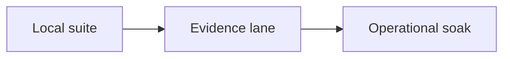

# Testing ACM and feeding it datasets

ACM uses three validation layers, in increasing order of realism and cost:



## Local suite

```bash
uv run pytest tests/ -q
uv run pytest tests/ -q -m "not statistical"
```

The suite covers the e-process guarantee, surprise models, episode lifecycle,
lifetime memory, immune/rehearsal behavior, runtime/service continuity, raw
storage, Tier-2 scorer parity, CARE replay machinery and repository hygiene.

Tests marked `statistical` run repeated-trial acceptance checks. Fixed seeds make
them reproducible; torch-dependent tests skip when torch is unavailable.

## Input contract

An ACM asset is a stream of rows with:

- one timezone-aware UTC timestamp column;
- at least two numeric sensor channels;
- no labels, status flags or fault annotations in the raw store.

Adapters may use labels for evaluation, but labels never enter model input.
Naive timestamps are rejected at the storage boundary; an adapter that knows a
dataset's documented timezone must declare it explicitly.

Cadence is not configured. ACM measures cadence, decorrelation and evidence
block sizes from the data itself. Assets stay `insufficient-history` until the
history can support the declared statistical guarantee.

### Programmatic seeding

```python
import polars as pl
from store.raw import RawStore, TIMESTAMP_COL

store = RawStore("acm_data/raw")
frame = pl.DataFrame({
    TIMESTAMP_COL: pl.Series(timestamps, dtype=pl.Datetime("us", "UTC")),
    "temp": temp_values,
    "vib": vibration_values,
})
store.append("plant/asset-01", frame)
```

Start the service against the same data root and it discovers, onboards and
bootstraps the asset.

### Other ingestion paths

The same normalization/store boundary is used by:

- CSV/parquet files;
- configured SQLite tables;
- JSON HTTP sources;
- live SQLite `(ts, payload_json)` buffers;
- manual/API ingestion;
- the `<data_root>/incoming/` drop folder.

## CARE evidence lane

Download selected farms/events without downloading the full ZIP first:

```bash
uv run python -m evidence.download_care --dest care_data --farms A
# optional partial farm:
uv run python -m evidence.download_care --dest care_data --farms A --count 5
```

The downloader creates:

```text
care_data/
  Wind Farm A/
    event_info.csv
    datasets/
      <event_id>.csv
```

Replay labeled events through the production runtime:

```bash
uv run python -m evidence.care_replay \
    --farm-dir "care_data/Wind Farm A" \
    --out results/care_A \
    --scorer tier0
```

A subset can be selected with `--events 40 68`. Scorer choices are `tier0`,
`worldmodel`, `masked` and `auto`.

Each event uses the real store -> onboard -> first-contact bootstrap -> chunked
tick path. Labels are held outside ACM and are used only to classify the replay
result as hit/miss or clean/false-alarm. Results are regression evidence, never
parameter-tuning targets.

### Live CARE demo

To watch those same event histories through a running fleet instead of an
isolated evaluation replay:

```bash
uv run python -m evidence.seed_demo \
    --farm-dir "care_data/Wind Farm A" --root acm_data
uv run python -m service --root acm_data --port 8899
```

`seed_demo` stores the full event chronologically as one asset. It deliberately
does not use CARE's train/prediction split because a live machine simply has a
continuous lifetime history.

## Adapting another labeled dataset

A fair degradation benchmark needs:

1. enough healthy history to arm ACM;
2. continuous multivariate telemetry;
3. fault onset timestamps;
4. faults that evolve on the industrial condition-monitoring timescale.

Convert the dataset into the CARE-shaped layout above. `tests/test_care_replay.py`
builds a minimal synthetic example and is the executable reference.

Do not interpret short security-attack bursts or snapshot classification sets as
condition-monitoring failures: they test a different problem and evidence
runway.

## Reading evidence honestly

- Normal events matter as much as anomalies because they exercise the
  false-alarm promise.
- Detection-lag resolution is bounded by replay chunk size.
- A pre-onset alarm is recorded separately; on a normal event it is a false
  alarm.
- `insufficient-history` is an outcome with an explicit reason, not a hidden
  failure.

## Operational soak

The soak drives the real service through compressed healthy, legitimate-change
and fault phases and reads its final episode state from the same SQLite store as
production:

```bash
uv run python -m evidence.soak --root results/soak --minutes 90
```

The target root must be empty. This prevents a previous run's state from making
a release check pass for the wrong reason.

Use the soak as the release-level lifecycle check after the local suite and
evidence lane. It validates unattended orchestration, durable state and state
transitions; it is not a parameter-tuning tool.
